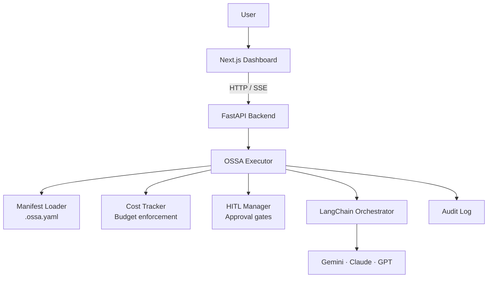
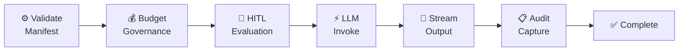
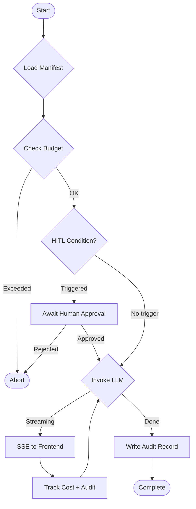
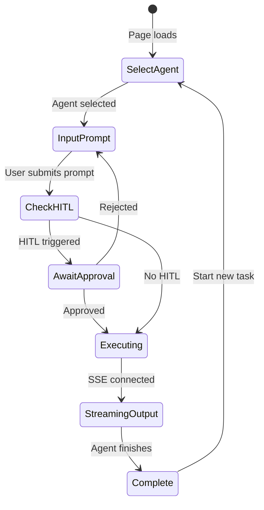

# OSSA — Open Standard for Service Agents

[](https://opensource.org/licenses/MIT)
[](https://www.python.org/)
[](https://nodejs.org/)
[]()
[](https://ossa-frontend-gygcwrc62a-uc.a.run.app/)
[](https://github.com/ramamurthy-540835/ossa)

> **Define once. Execute anywhere. Govern automatically.**

OSSA is a vendor-neutral specification for AI agents with governance built in — compliance, cost controls, human-in-the-loop approval, and audit logging — all declared in a single YAML manifest. No boilerplate. No scattered config. One file governs everything.

**[→ Live Dashboard](https://ossa-frontend-gygcwrc62a-uc.a.run.app/) · [→ API Docs](https://ossa-backend-gygcwrc62a-uc.a.run.app/docs) · [→ Download Presentation](https://ossa-backend-gygcwrc62a-uc.a.run.app/api/presentation/download)**

---

## Why OSSA

Most AI agent deployments fail at governance. Token budgets are hardcoded or missing entirely. Compliance requirements are an afterthought. Sensitive inputs go to LLMs without human review. Audit trails exist only if someone remembered to add logging. OSSA makes all of these structural — enforced at the spec level, not the code level.

One YAML manifest describes the agent's role, its LLM provider, the compliance frameworks it must satisfy, per-execution and daily cost limits, and the exact conditions that trigger human approval. The OSSA executor enforces every constraint at runtime. Changing providers from Gemini to Claude to GPT-4 is a one-line edit — governance travels with the manifest, not with the provider.

---

## How It Works



### Execution Pipeline

Every agent run passes through seven stages in sequence — no stage can be skipped:



### Agent Execution Flow



### Frontend User Flow



---

## Sample Manifest

```yaml
apiVersion: ossa/v0.4.6
kind: Agent
metadata:
  name: document-summarizer
spec:
  llm:
    provider: gemini          # ← swap to: anthropic / openai
    model: gemini-2.5-flash
    temperature: 0.7

  compliance:
    frameworks: [HIPAA, SOC2]
    dataClassification: confidential
    retentionDays: 90

  cost:
    tokenBudget:
      perExecution: 2000
      perDay: 50000
    spendLimits:
      daily: 0.50
      monthly: 10.00

  hitl:
    enabled: true
    interventionPoints:
      - trigger:
          type: on_condition
          condition: input_size > 5000
        mode: ALWAYS

  audit:
    enabled: true
    logLevel: detailed
```

Manifests live in `backend/manifests/*.ossa.yaml`. Create new ones from the dashboard or POST to `/api/manifests`.

---

## Features

**Manifest-as-Code governance.** Every aspect of an agent's behaviour — provider, model, compliance, cost limits, HITL rules — is declared in a YAML file that lives in version control. Policy changes are pull requests. Rollbacks are reverts.

**Vendor-neutral by design.** The LangChain orchestration layer abstracts Gemini, Anthropic, and OpenAI behind a single interface. Your governance manifest is unchanged when you switch providers. The current primary integration is Gemini 2.5 Flash; Claude and GPT-4 interfaces are wired and ready.

**Cost governance with hard limits.** The `CostTracker` enforces `tokenBudget.perExecution` and `spendLimits.daily` before any tokens are consumed. Executions that would breach a limit are rejected upfront — not after the fact. Live cost estimates stream to the dashboard during execution.

**Human-in-the-loop approval gates.** HITL `interventionPoints` define conditions under which execution pauses for human review. The default trigger is `input_size > 5000` characters. When triggered, the dashboard surfaces an approval prompt; `POST /api/agent/approve` resumes or aborts the run. Every decision is recorded in the audit log.

**Structured audit trail.** Every execution writes a structured record: timestamp, agent name, provider, model, token usage, cost, HITL decisions, compliance status, and output metadata. Records are queryable via `GET /api/audit/logs` and displayed in real time in the dashboard's audit strip.

**Compliance framework declarations.** Manifests declare SOC2, HIPAA, PCI-DSS, or GDPR adherence alongside data classification (`confidential`, `internal`, `public`) and retention policy. These declarations appear in every audit record, providing the documentation chain required for compliance investigations.

---

## Quick Start

```bash
git clone https://github.com/ramamurthy-540835/ossa.git
cd ossa

# Add your API key
echo "GEMINI_API_KEY=your_key_here" > backend/.env.local

# Start both services
./start.sh
# → http://localhost:3001
```

**Prerequisites:** Python 3.10+, Node 18+, Gemini API key ([free tier](https://aistudio.google.com))

Or run manually:

```bash
# Terminal 1 — backend on :8000
cd backend && pip install -r requirements.txt && python main.py

# Terminal 2 — frontend on :3001
cd frontend && npm install && npm run dev -- --port 3001
```

---

## API Reference

| Method | Endpoint | Description |
|--------|---------|-------------|
| `GET` | `/health` | Service health check |
| `GET` | `/api/manifests` | List all agent manifests |
| `POST` | `/api/manifests` | Create manifest from YAML |
| `GET` | `/api/manifests/{name}` | Get manifest details |
| `DELETE` | `/api/manifests/{name}` | Delete manifest |
| `POST` | `/api/agent/execute` | Execute agent |
| `GET` | `/api/agent/events/{id}` | Stream execution events (SSE) |
| `GET` | `/api/agent/status/{id}` | Get execution status |
| `POST` | `/api/agent/approve` | Approve HITL intervention |
| `GET` | `/api/artifacts/{id}/download?fmt=md` | Download result as Markdown |
| `GET` | `/api/artifacts/{id}/download?fmt=json` | Download result as JSON |
| `GET` | `/api/audit/logs` | All audit logs |
| `GET` | `/api/presentation/download` | Download OSSA deck (PPTX) |

Full Swagger UI: [ossa-backend-gygcwrc62a-uc.a.run.app/docs](https://ossa-backend-gygcwrc62a-uc.a.run.app/docs)

---

## Tech Stack

| Layer | Technology | Purpose |
|-------|-----------|---------|
| Frontend | Next.js 14 + React 18 + TypeScript + Tailwind | Dashboard UI |
| Backend | FastAPI + Python 3.10+ + Pydantic + Uvicorn | API + agent execution |
| Orchestration | LangChain Core | LLM provider abstraction |
| LLM | Gemini 2.5 Flash (primary) · Claude · GPT | Language models |
| Governance | OSSA Executor + Cost Tracker + HITL Manager | Spec enforcement |
| Real-time | Server-Sent Events | Live streaming |
| Deployment | GCP Cloud Run + Cloud Build + Secret Manager | Production hosting |

---

## Project Structure

```
ossa/
├── backend/
│   ├── main.py                    # FastAPI entry point
│   ├── ossa/
│   │   ├── executor.py            # Agent orchestration engine
│   │   ├── manifest.py            # Manifest parsing + validation
│   │   ├── cost_tracker.py        # Budget enforcement
│   │   └── langchain_orchestrator.py  # LLM abstraction layer
│   ├── manifests/                 # *.ossa.yaml agent definitions
│   └── providers/gemini.py        # Gemini integration
├── frontend/
│   ├── app/page.tsx               # Main dashboard
│   └── components/                # UI components
├── docs/                          # In-dashboard documentation
├── cloudbuild.yaml                # GCP CI/CD pipeline
└── start.sh                       # Local dev launcher
```

---

## Deployment

**GCP Cloud Run (production):**
```bash
gcloud builds submit --config=cloudbuild.yaml --project=ctoteam .
```

Live URLs after deploy:
- Dashboard: `https://ossa-frontend-gygcwrc62a-uc.a.run.app`
- API: `https://ossa-backend-gygcwrc62a-uc.a.run.app`

**Environment variables** (`backend/.env.local`):

| Variable | Required | Description |
|----------|---------|-------------|
| `GEMINI_API_KEY` | Yes | Google Gemini API key |
| `ANTHROPIC_API_KEY` | Optional | Anthropic Claude key |
| `OPENAI_API_KEY` | Optional | OpenAI key |

---

## Bundled Agents

| Agent | Compliance | HITL |
|-------|-----------|------|
| Code Developer | SOC2, HIPAA, ISO27001, GDPR | Yes |
| Aider Style Code Developer | SOC2, HIPAA | Yes |
| Code Analyzer | SOC2 | No |
| Document Summarizer | SOC2, HIPAA | Yes |
| Research Agent | SOC2 | No |
| Security Auditor | SOC2, HIPAA | Yes |

---

## Roadmap

- [ ] Full Anthropic + OpenAI provider integration
- [ ] Manifest schema v0.5.0
- [ ] PII detection + sensitive data masking
- [ ] Multi-step agent workflow chaining
- [ ] Historical cost analytics dashboard
- [ ] Expanded HITL conditions (cost threshold, output classification)
- [ ] Kubernetes deployment guide
- [ ] Comprehensive test suite

---

## Contributing

```bash
git checkout -b feature/your-feature
git commit -m 'feat: your change'
git push origin feature/your-feature
# open a PR against main
```

Areas welcome: LLM provider integrations, governance policies, UI, test coverage.

---

## License

MIT — see [LICENSE](LICENSE).

---

*OSSA · Open Standard for Service Agents · v0.4.6 · [ramamurthy-540835](https://github.com/ramamurthy-540835)*
