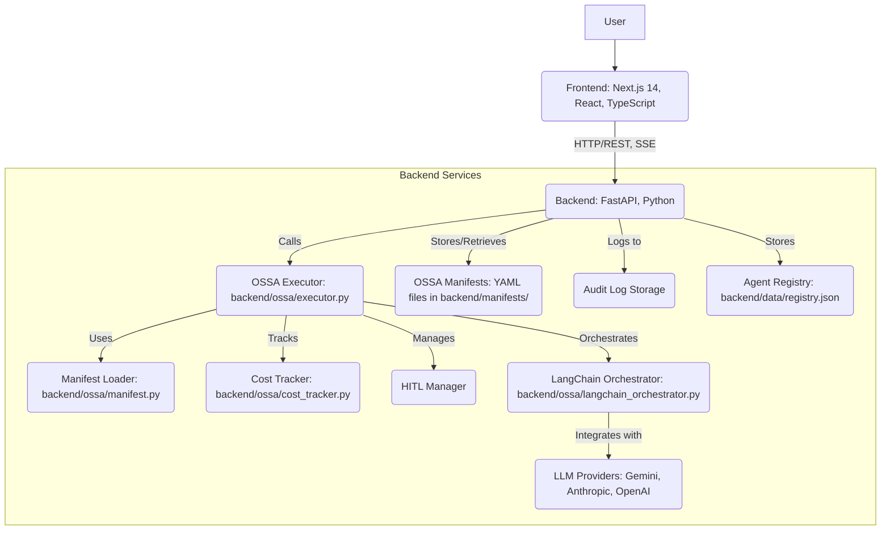
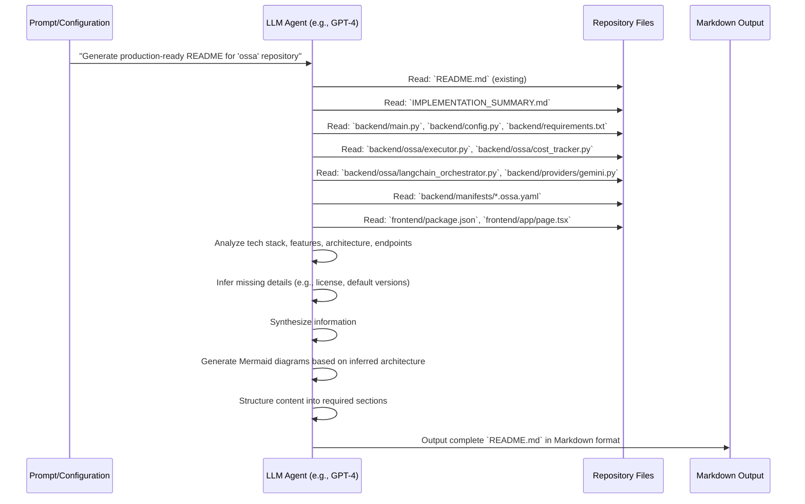
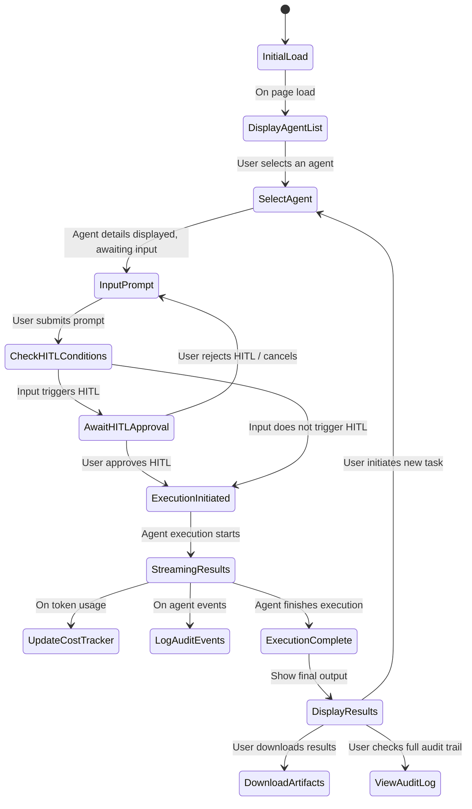
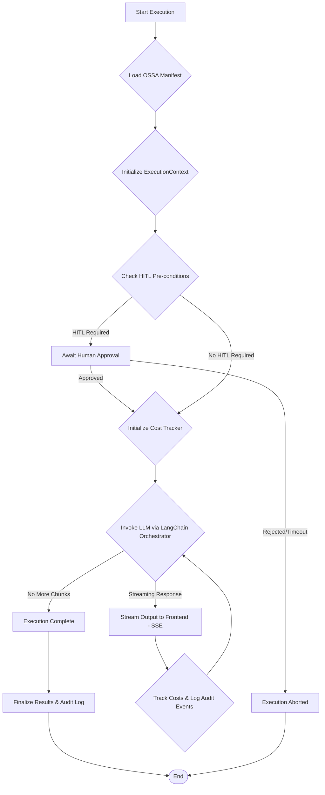
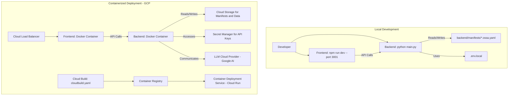

# 🤖 ossa


ossa is an **Open Standard for Service Agents (OSSA)** dashboard designed to empower organizations to define, run, and govern AI agents with unparalleled control and visibility. This production-ready software project offers a comprehensive solution for deploying LLM-powered agents, incorporating essential enterprise-grade features such as built-in compliance, real-time cost controls, Human-In-The-Loop (HITL) workflows, and robust audit logging.

## Quick Overview

The `ossa` project provides a functional dashboard that simplifies the management and execution of AI agents. It addresses critical challenges in LLM operations by ensuring vendor-neutral governance, transparent cost tracking, and human oversight where necessary. This dashboard is ideal for developers, MLOps engineers, and organizations that demand high standards of compliance and auditability for their AI workflows.

**Key capabilities include:**

*   **Vendor-Neutral LLM Governance:** Define agents using a standardized OSSA Manifest format, supporting multiple LLM providers.
*   **Real-time Execution & Streaming:** Run agents and receive live output streams directly in the dashboard.
*   **Cost Management:** Track token usage and estimated costs in real-time with configurable budgets and spend limits.
*   **Human-In-The-Loop (HITL) Workflows:** Implement approval gates for critical or sensitive agent actions, triggered by predefined conditions (e.g., input size).
*   **Compliance & Audit Logging:** Maintain detailed audit trails of all agent executions, including compliance framework adherence (SOC2, HIPAA, PCI-DSS, GDPR).
*   **Agent Lifecycle Management:** Create, list, update, and delete agent manifests directly from the UI or API.

## Demo and Screenshot Flow

*(Placeholder for an actual screenshot or GIF demonstrating the dashboard in action. For now, imagine the following user interaction.)*

1.  **Dashboard Load:** Upon navigating to the application, users are greeted with a sidebar listing available agents and a main panel for execution.
2.  **Agent Selection:** A user selects an agent from the sidebar, e.g., "document-summarizer". The main panel updates to show the agent's description and an input text area.
3.  **Input & Execution:** The user types or pastes text into the input field and clicks "Run Agent".
4.  **Real-time Streaming:** The execution panel displays live, streaming responses from the agent. An audit log at the bottom updates with events, and a cost tracker shows real-time token usage and estimated spend.
5.  **HITL Intervention:** If the input or agent configuration triggers a Human-In-The-Loop condition (e.g., `input_size > 5000`), a clear prompt appears, requiring human approval before the agent proceeds.
6.  **Results & Artifacts:** Once execution is complete, the final output is displayed. Users can download the results in Markdown or JSON format, or share them via a pre-filled email.
7.  **Audit Log Review:** The comprehensive audit log at the bottom provides a full trace of the agent's actions, decisions, and compliance checks.
8.  **New Agent Creation:** Users can click "+ New Agent" to open a modal, define a new agent using the OSSA Manifest structure, configure its LLM, compliance, cost, and HITL settings, and save it.

## Key Features

The `ossa` dashboard provides a robust set of features for managing and operating AI agents:

*   **Agent Management:**
    *   **Define Agents:** Create and manage AI agent configurations using a clear, YAML-based OSSA Manifest format, stored as `.ossa.yaml` files in `backend/manifests/`.
    *   **Agent Catalog:** Easily list and select from a catalog of pre-defined or custom agents.
    *   **Configuration:** Specify LLM provider (Gemini, Anthropic, OpenAI), model, temperature, and token limits.
*   **Execution & Control:**
    *   **Real-time Execution:** Initiate agent runs with user prompts and observe results as they stream in via Server-Sent Events (SSE).
    *   **Human-In-The-Loop (HITL):** Configure conditional approval gates (e.g., `input_size > 5000`) for human review and intervention, crucial for sensitive tasks.
    *   **Cost Controls:** Set `tokenBudget` and `spendLimits` per execution and daily, with real-time cost estimation and alerts, leveraging provider-specific pricing from `backend/ossa/cost_tracker.py`.
*   **Governance & Compliance:**
    *   **Compliance Frameworks:** Declare adherence to compliance standards like SOC2, HIPAA, PCI-DSS, and GDPR, specified within each agent's manifest.
    *   **Data Classification:** Categorize data handled by agents (e.g., `confidential`, `internal`, `public`) to enforce appropriate policies.
    *   **Audit Logging:** Comprehensive, real-time logging of all agent activities, inputs, outputs, and decisions for full traceability and regulatory compliance.
    *   **Data Retention Policies:** Define how long agent interaction data should be retained and if it should be auto-deleted.
*   **Output & Collaboration:**
    *   **Artifact Downloads:** Download execution results in human-readable Markdown or machine-parseable JSON formats.
    *   **Share Results:** Conveniently share agent outputs via pre-filled email templates.
*   **Extensibility:**
    *   **Modular LLM Providers:** Designed to be extensible with different LLM providers, currently supporting Gemini 2.5 Flash, with interfaces for Anthropic and OpenAI via `backend/ossa/langchain_orchestrator.py`.
    *   **FastAPI Backend:** A robust and scalable Python backend using FastAPI for API services.
    *   **Next.js Frontend:** A modern, responsive user interface built with Next.js 14, React, and Tailwind CSS.

## Architecture

The `ossa` project follows a clear two-tier architecture, separating the presentation layer from the business logic and data processing.

### System Architecture

The system comprises a FastAPI backend and a Next.js frontend, interacting through a well-defined API. The backend orchestrates agent execution, interacts with LLM providers, and manages governance features, while the frontend provides an intuitive user interface.



### README Generation (Meta) Sequence Diagram

This sequence diagram illustrates the conceptual flow of how a comprehensive `README.md` for a complex project like `ossa` is generated, drawing information from various source files and project metadata. This reflects the automated process that was used to construct *this* very document.



### Frontend User Flow State Diagram

The frontend user experience guides users through agent selection, execution, and review, incorporating Human-In-The-Loop decision points.



### OSSA Agent Execution Flow

The `OSSAAgentExecutor` in `backend/ossa/executor.py` orchestrates the lifecycle of an agent's execution, integrating cost tracking, HITL, and LLM interaction via the `LangChainOrchestrator`.



### Deployment Architecture

The project is designed for local development, leveraging separate Node.js and Python environments. For production, containerization via Docker is enabled, suitable for deployment on cloud platforms like Google Cloud, hinted by `cloudbuild.yaml` and `.gcloudignore`.



## Tech Stack

This project is built using a modern and robust tech stack:

*   **Frontend:**
    *   **Next.js 14:** React framework for building fast, scalable web applications.
    *   **React:** Declarative JavaScript library for building user interfaces.
    *   **TypeScript:** Type-safe superset of JavaScript, enhancing code quality and maintainability.
    *   **Tailwind CSS:** Utility-first CSS framework for rapid UI development.
    *   **npm:** Package manager for JavaScript.
*   **Backend:**
    *   **FastAPI:** Modern, fast (high-performance) web framework for building APIs with Python 3.10+, based on standard Python type hints.
    *   **Python 3.10+:** The primary programming language for the backend logic.
    *   **Pydantic:** Data validation and settings management using Python type hints.
    *   **Uvicorn:** ASGI server for running FastAPI applications.
    *   **LangChain Core:** Framework for developing applications powered by language models, used for LLM orchestration in `backend/ossa/langchain_orchestrator.py`.
    *   **google-generativeai SDK:** Direct integration with Gemini models via Google's official API.
    *   **PyYAML:** For parsing and managing OSSA agent manifests.
*   **LLM Providers:**
    *   **Gemini 2.5 Flash:** Primary LLM integrated, configurable via `GEMINI_API_KEY`.
    *   **Anthropic / OpenAI:** Interfaces are present in `langchain_orchestrator.py` for potential future integration.
*   **Containerization:**
    *   **Docker:** Used for containerizing both frontend and backend services, with `Dockerfile`s provided.

## Installation and Setup

To get `ossa` up and running, you'll need to set up both the backend (Python) and frontend (Node.js) components.

### Prerequisites

*   **Python 3.10+** and `pip`
*   **Node.js 18+** and `npm`
*   A **Google Gemini API Key** (or `GOOGLE_API_KEY`) for LLM interactions. Optionally, Anthropic or OpenAI keys if their providers are enabled and used.

### Step-by-Step Setup

1.  **Clone the Repository:**

    ```bash
    git clone https://github.com/ramamurthy-540835/ossa.git
    cd ossa
    ```

2.  **Configure API Keys:**
    Create a file named `.env.local` in the `backend/` directory.
    Add your Gemini API key:

    ```ini
    # backend/.env.local
    GEMINI_API_KEY=YOUR_GEMINI_API_KEY
    # GOOGLE_API_KEY=YOUR_GOOGLE_API_KEY # Alternative for Gemini
    # ANTHROPIC_API_KEY=YOUR_ANTHROPIC_API_KEY # Optional, for Anthropic models
    # OPENAI_API_KEY=YOUR_OPENAI_API_KEY # Optional, for OpenAI models
    ```
    *(Note: `backend/config.py` uses `pydantic-settings` to load from `.env.local`.)*

3.  **Backend Setup:**

    ```bash
    cd backend
    pip install -r requirements.txt
    python main.py
    ```
    The backend will start on `http://localhost:8000`.

4.  **Frontend Setup:**
    Open a **new terminal** window.

    ```bash
    cd frontend
    npm install
    npm run dev -- --port 3001
    ```
    The frontend will start on `http://localhost:3001`.

## Quick Start and Usage Guide

Once both the backend and frontend servers are running, you can access the OSSA Agent Dashboard.

### Using the `start.sh` Script (Recommended)

A convenience script is provided to start both frontend and backend processes automatically:

```bash
./start.sh
# Open http://10.100.15.44:3001 (or http://localhost:3001)
```

The script will launch both services, and you can then navigate to the specified URL in your web browser.

### Dashboard Operations

*   **Run an Agent:**
    1.  Select an agent from the sidebar on the left.
    2.  Type your prompt into the input field.
    3.  Click "Run Agent" to initiate execution.
*   **Create a New Agent:**
    1.  Click the **+ New Agent** button in the sidebar.
    2.  Fill out the form with the agent's details, including its role, LLM configuration, compliance settings, cost controls, and HITL preferences.
    3.  Click "Create" to save your new agent manifest. These are stored as YAML files in `backend/manifests/`.
*   **Download Results:**
    *   After an agent completes execution, options will appear to "Copy", "Download Markdown", or "Download JSON" for the generated output.
*   **Share Results:**
    *   Click "Share" to open your default email client with a pre-filled email containing the agent's output.
*   **View Audit Log:**
    *   A bottom strip on the dashboard displays all execution events in real-time, providing a detailed audit trail.
*   **Human-In-The-Loop (HITL) Approval:**
    *   For agents configured with HITL, large or critical inputs may trigger a human-approval gate, requiring user confirmation to proceed. This mechanism is defined in agent manifests (e.g., `condition: input_size > 5000`).

## API Reference

The `ossa` backend provides a comprehensive RESTful API for managing agents and their executions. You can access the auto-generated API documentation (Swagger UI) at `http://localhost:8000/docs`.

| Method | Path | Description |
|---|---|---|
| `GET` | `/health` | Health check endpoint for service status. |
| `GET` | `/api/manifests` | Lists all available OSSA agent manifests, including metadata and configurations. |
| `POST` | `/api/manifests` | Creates a new OSSA agent manifest from provided YAML data. |
| `DELETE` | `/api/manifests/{name}` | Deletes an OSSA agent manifest by its name. |
| `GET` | `/api/manifests/{manifest_name}/yaml` | Downloads the raw YAML content of a specific agent manifest. |
| `GET` | `/api/manifests/{name}` | Retrieves detailed information for a specific OSSA agent manifest. |
| `POST` | `/api/agent/execute` | Initiates the execution of a specified agent with a given input. |
| `GET` | `/api/agent/events/{id}` | Streams real-time execution events for a given `execution_id` via Server-Sent Events (SSE). |
| `GET` | `/api/agent/status/{id}` | Retrieves the current status and summary for an ongoing or completed execution. |
| `POST` | `/api/agent/approve` | Approves a pending Human-In-The-Loop (HITL) intervention for an `execution_id`. |
| `GET` | `/api/artifacts/{id}/download?fmt=md` | Downloads the final result of an execution as a Markdown file. |
| `GET` | `/api/artifacts/{id}/download?fmt=json` | Downloads the final result of an execution as a JSON file. |
| `GET` | `/api/audit/logs` | Retrieves a list of all historical execution audit logs. |

## Project Structure

The `ossa` repository is organized into distinct directories for the frontend, backend, documentation, and agent manifests:

```
ossa/
├── .gcloudignore                   # Files to ignore when deploying to Google Cloud
├── .gitignore                      # Standard Git ignore file
├── IMPLEMENTATION_SUMMARY.md       # Detailed summary of project implementation (meta-document)
├── README.md                       # This README file
├── start.sh                        # Convenience script to start both backend and frontend
├── backend/                        # FastAPI backend application
│   ├── .dockerignore               # Docker ignore for backend
│   ├── Dockerfile                  # Dockerfile for backend service
│   ├── config.py                   # Global configuration and settings (loads from .env.local)
│   ├── data/                       # Stores internal data like agent registry (registry.json)
│   ├── main.py                     # Main FastAPI application entry point
│   ├── manifests/                  # OSSA agent manifest definitions (*.ossa.yaml)
│   │   ├── aider-style-code-developer.ossa.yaml
│   │   ├── code-analyzer.ossa.yaml
│   │   ├── code-developer.ossa.yaml
│   │   ├── document-summarizer.ossa.yaml
│   │   ├── research-agent.ossa.yaml
│   │   └── security-auditor.ossa.yaml
│   ├── ossa/                       # Core OSSA framework components
│   │   ├── __init__.py             # Python package init
│   │   ├── cost_tracker.py         # Handles cost tracking and budget enforcement
│   │   ├── executor.py             # Main OSSA agent orchestration engine
│   │   ├── langchain_orchestrator.py # LangChain-based LLM interaction and parsing
│   │   └── manifest.py             # OSSA manifest parsing and validation
│   ├── providers/                  # LLM provider integrations
│   │   └── gemini.py               # Gemini LLM provider implementation
│   ├── requirements.txt            # Python dependencies
│   └── schemas/                    # Pydantic models for API request/response validation
├── cloudbuild-frontend.yaml        # Google Cloud Build config for frontend
├── cloudbuild.yaml                 # Google Cloud Build config for backend
├── docs/                           # Project documentation (e.g., agent standards, compliance)
│   ├── agent-standards.md
│   ├── compliance-frameworks.md
│   ├── cost-governance.md
│   ├── execution-pipeline.md
│   ├── getting-started.md
│   ├── hitl-guide.md
│   └── manifest-reference.md
└── frontend/                       # Next.js 14 / React frontend application
    ├── .dockerignore               # Docker ignore for frontend
    ├── .gitignore                  # Standard Git ignore
    ├── Dockerfile                  # Dockerfile for frontend service
    ├── app/                        # Next.js app directory structure
    │   ├── globals.css
    │   ├── layout.tsx
    │   └── page.tsx                # Main dashboard page
    ├── components/                 # Reusable React components (e.g., AuditLogViewer, ExecutionPanel)
    ├── lib/                        # Frontend utilities, API clients, hooks, types
    ├── package.json                # Node.js dependencies
    ├── next.config.js              # Next.js configuration
    └── ...                         # Other frontend specific files
```

## Configuration

The backend's configuration is managed through `backend/config.py`, which leverages `pydantic-settings` to load values from environment variables or a `.env.local` file.

*   **API Keys:** Essential API keys for LLM providers (e.g., `GEMINI_API_KEY`) must be set in `backend/.env.local`.
*   **Default Provider:** The `default_provider` setting in `config.py` currently defaults to `gemini`.
*   **Server Ports:** The backend runs on port `8000` (`PORT` environment variable), and the frontend typically runs on `3001`.
*   **Manifests:** Agent definitions are YAML files (`*.ossa.yaml`) stored in `backend/manifests/`. New agents created via the dashboard will also be saved here.

## Contributing

We welcome contributions to the `ossa` project! If you're interested in improving this open standard for service agents, please consider:

*   **Reporting Bugs:** Open an issue on GitHub describing any bugs you encounter.
*   **Suggesting Features:** Propose new features or enhancements through GitHub issues.
*   **Submitting Pull Requests:** Fork the repository, create a feature branch, and submit a pull request with your changes. Please ensure your code adheres to existing style guides and includes appropriate tests.

## Roadmap and Future Enhancements

The `ossa` project is continuously evolving. Planned enhancements and future directions include:

*   **Expanded LLM Provider Support:** Officially integrate and provide full configuration for Anthropic, OpenAI, and other major LLM providers.
*   **Advanced Governance Policies:** Implement more granular control over data handling, sensitive information detection, and automated policy enforcement.
*   **Workflow Orchestration:** Support for multi-step agent workflows and chaining capabilities.
*   **Enhanced Monitoring & Analytics:** Detailed dashboards for historical cost analysis, agent performance, and usage patterns.
*   **Dynamic Manifest Management:** Provide a more robust system for managing agent manifests, potentially integrating with a version control system or database.
*   **Containerized Deployment Guides:** Comprehensive documentation for deploying `ossa` using Docker and Kubernetes to various cloud providers.
*   **Frontend UI/UX Improvements:** Further polish the dashboard's user interface and experience, including guided tours and more interactive elements.
*   **Comprehensive Testing:** Expand unit, integration, and end-to-end test coverage.

## Troubleshooting

Here are some common issues and their solutions:

*   **`GEMINI_API_KEY not set` warning:** Ensure you have created `backend/.env.local` and set `GEMINI_API_KEY` (or `GOOGLE_API_KEY`) correctly as described in the Installation section.
*   **Backend or Frontend port conflict:**
    *   If the backend (FastAPI) port 8000 is in use, you can set the `PORT` environment variable before running `python main.py` (e.g., `PORT=8001 python main.py`).
    *   If the frontend (Next.js) port 3001 is in use, modify the `npm run dev` command to use a different port (e.g., `npm run dev -- --port 3002`).
*   **Dependencies not found:**
    *   For the backend, ensure you run `pip install -r requirements.txt` within the `backend/` directory.
    *   For the frontend, ensure you run `npm install` within the `frontend/` directory.
*   **Frontend not connecting to backend:**
    *   Verify both the backend and frontend are running.
    *   Check your browser's developer console for network errors. Ensure the backend is accessible from the frontend's origin (CORS is configured in `backend/main.py` but local development might have specific browser security settings).

## License

This project is licensed under the MIT License. See the [LICENSE](LICENSE) file for details.

## Acknowledgments and Footer

This project was developed with the aim of advancing standardized governance for AI agents. We thank the open-source community for the invaluable tools and libraries that made `ossa` possible.
© 2024 ramamurthy-540835. All rights reserved.