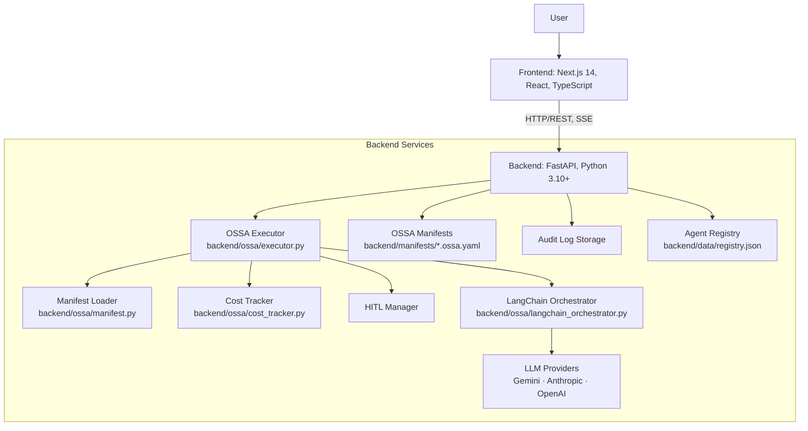
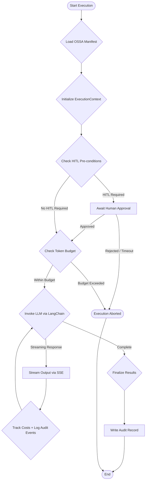
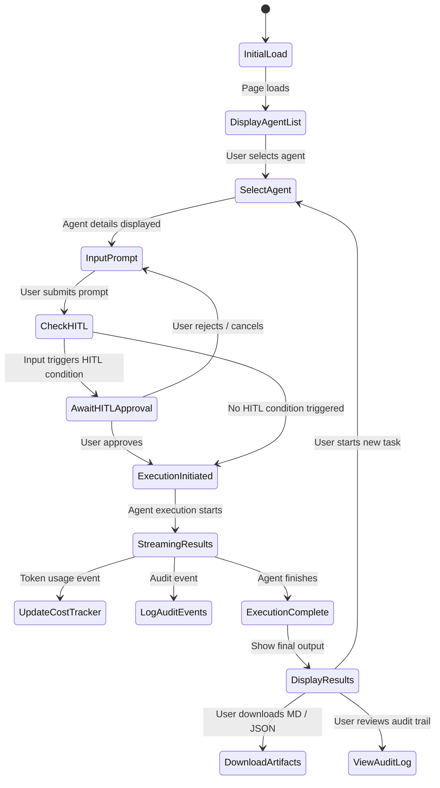
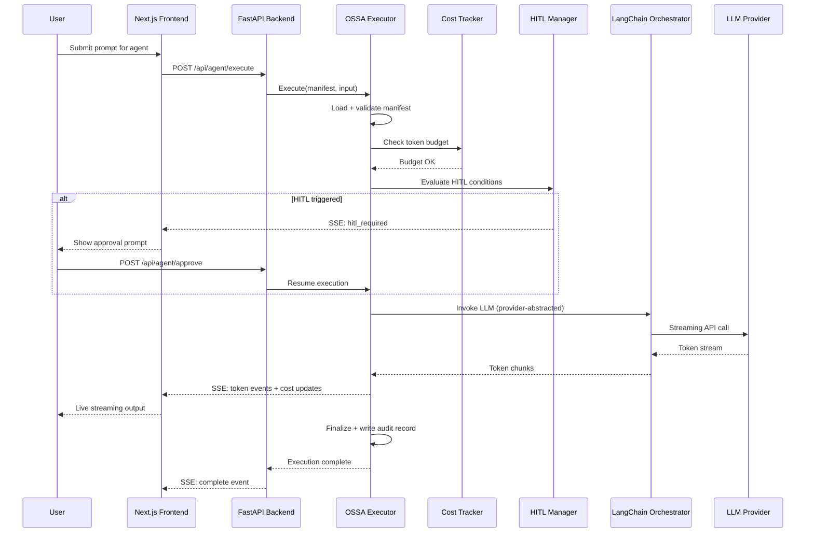
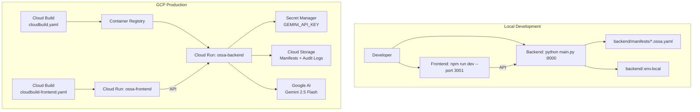

# 🏛️ OSSA — Open Standard for Service Agents

**Vendor-Neutral AI Governance · v0.4.6**

[](https://opensource.org/licenses/MIT)
[](https://www.python.org/)
[](https://nodejs.org/)
[]()
[](https://github.com/ramamurthy-540835/ossa)
[](https://ossa-frontend-gygcwrc62a-uc.a.run.app/)

> **"Define once. Execute anywhere. Govern automatically."**

OSSA is a specification for defining AI agents with built-in governance — compliance, cost controls, human approval workflows, and audit logging — all declared in a single YAML manifest.

---

## Table of Contents

- [Overview](#overview)
- [Core Principles](#core-principles)
- [Key Features](#key-features)
- [Architecture](#architecture)
- [OSSA Manifest Reference](#ossa-manifest-reference)
- [Execution Pipeline](#execution-pipeline)
- [Tech Stack](#tech-stack)
- [Quick Start](#quick-start)
- [Usage Guide](#usage-guide)
- [API Reference](#api-reference)
- [Project Structure](#project-structure)
- [Configuration](#configuration)
- [Deployment](#deployment)
- [Troubleshooting](#troubleshooting)
- [Contributing](#contributing)
- [Roadmap](#roadmap)
- [License](#license)

---

## Overview

**OSSA (Open Standard for Service Agents)** is a production-ready governance framework that solves one of the hardest problems in enterprise AI adoption: how do you deploy LLM-powered agents with confidence that they will stay within budget, remain compliant, respect human oversight, and produce an auditable record of every action?

Today's AI agent deployments are fragile by design. Teams hardcode API keys, skip cost limits, ignore compliance requirements, and discover problems only when a runaway agent burns through a monthly budget overnight or a compliance audit surfaces undocumented LLM interactions. OSSA eliminates this class of problems by making governance declarative — defined once in a manifest, enforced automatically at every execution.

The OSSA dashboard at [ossa-frontend-gygcwrc62a-uc.a.run.app](https://ossa-frontend-gygcwrc62a-uc.a.run.app/) delivers a fully operational demonstration: define agents via YAML manifests, execute them with real-time streaming output, enforce token budgets and spend limits, require human approval for sensitive inputs, and review a complete audit trail — all without writing a line of governance code.

What distinguishes OSSA from comparable frameworks is its vendor neutrality. Switching your LLM provider from Gemini to Claude to GPT-4 requires changing exactly one line in the manifest. All compliance declarations, cost limits, HITL gates, and audit configurations transfer automatically. Your governance layer is decoupled from your model layer by design.

---

## Core Principles

**Define once**
One YAML manifest describes everything — the agent role, LLM configuration, compliance rules, cost limits, and HITL gates. Version it, review it, and deploy it like any other infrastructure-as-code artifact.

**Execute anywhere**
Switch `gemini` → `anthropic` → `openai` by changing one line. All governance stays identical. OSSA abstracts the LLM provider behind a uniform execution interface.

**Govern automatically**
Cost budgets are enforced at runtime before LLM invocation. HITL gates trigger automatically on configured conditions. Every action is audited without manual instrumentation.

**Trust by design**
Compliance frameworks (HIPAA, SOC2, PCI-DSS, GDPR) are declared per agent. Data classification and retention policies are built into the manifest, not bolted on afterward.

---

## Key Features

**Manifest as Code**

OSSA agents are defined entirely in YAML — provider, model, temperature, compliance frameworks, token budgets, spend limits, and HITL rules. Manifests are stored as `.ossa.yaml` files, version-controlled alongside your application code, and loaded at runtime without compilation. Any change to governance policy is a diff in a text file, reviewable in a pull request.

**Vendor-Neutral LLM Switching**

The OSSA execution engine abstracts all three major LLM providers behind a single `LangChainOrchestrator` interface. Switch from `gemini-2.5-flash` to `claude-3-opus` to `gpt-4o` by editing the `provider` and `model` fields in your manifest. Cost tracking, HITL logic, and audit logging require no changes — they operate on the abstracted execution context, not the provider-specific API.

**Human-in-the-Loop (HITL) Approval Gates**

HITL gates are configured per agent as conditional triggers. When a condition is met — for example `input_size > 5000` — the executor pauses execution, surfaces an approval prompt in the dashboard, and waits for explicit human confirmation before proceeding. Rejected or timed-out approvals abort the execution cleanly, with the reason recorded in the audit log.

**Cost Governance with Hard Limits**

Every agent manifest declares a `tokenBudget` (per execution and per day) and `spendLimits` (daily USD ceiling). The `CostTracker` enforces these limits before and during LLM invocation using provider-specific pricing data. Executions that would breach a budget are rejected before any tokens are consumed. Real-time cost estimates are streamed to the dashboard during execution.

**Audit Logging**

Every agent execution produces a structured audit trail: timestamp, agent name, provider, model, input summary, token usage, cost, HITL decisions, compliance checks, and final output metadata. Logs are queryable via the `/api/audit/logs` endpoint and displayed in real-time in the dashboard's audit strip. No custom instrumentation required.

**Compliance Framework Declarations**

Manifests declare adherence to compliance standards — `SOC2`, `HIPAA`, `PCI-DSS`, `GDPR` — alongside data classification levels (`confidential`, `internal`, `public`) and retention policies. These declarations are enforced at the policy layer and included in every audit record, providing the documentation chain required for compliance investigations.

**Real-time Streaming Execution**

Agent outputs stream to the dashboard via Server-Sent Events (SSE) as tokens are generated, giving users immediate feedback without waiting for full completion. The execution panel updates live with token counts, running cost estimates, and audit events — all on a single page without polling.

**Agent Lifecycle Management**

Create, list, update, and delete agent manifests directly from the dashboard UI or via the REST API. New agents defined through the "+ New Agent" modal are persisted as `.ossa.yaml` files in `backend/manifests/` and immediately available for execution. The agent catalog in the sidebar reflects the current state of the manifest directory.

---

## Architecture

### System Architecture



### OSSA Agent Execution Flow



### Frontend User Flow



### Execution Pipeline Detail



### Deployment Architecture



---

## OSSA Manifest Reference

The OSSA manifest is the single source of truth for an agent's behavior and governance. Every `.ossa.yaml` file follows the schema below.

```yaml
apiVersion: ossa/v0.4.6
kind: Agent
metadata:
  name: document-summarizer          # Unique agent identifier
  description: Summarizes documents  # Human-readable description

spec:
  llm:
    provider: gemini                  # gemini | anthropic | openai
    model: gemini-2.5-flash           # Model identifier
    temperature: 0.7                  # Generation temperature (0.0–1.0)
    maxOutputTokens: 2048             # Max tokens per response

  compliance:
    frameworks: [HIPAA, SOC2]         # Declared compliance standards
    dataClassification: confidential  # confidential | internal | public
    retentionDays: 90                 # Audit log retention

  cost:
    tokenBudget:
      perExecution: 2000              # Max tokens per single execution
      perDay: 50000                   # Max tokens per day across all executions
    spendLimits:
      daily: 0.50                     # Max USD spend per day
      monthly: 10.00                  # Max USD spend per month

  hitl:
    enabled: true
    interventionPoints:
      - trigger:
          type: on_condition
          condition: input_size > 5000  # Trigger when input exceeds 5000 chars
        mode: ALWAYS                    # Always require approval when triggered

  audit:
    enabled: true
    logLevel: detailed                # minimal | standard | detailed
    includeInput: false               # Whether to log raw input (PII concern)
    includeOutput: false              # Whether to log raw output
```

**Bundled agent manifests** (in `backend/manifests/`):

| Manifest | Purpose | Compliance |
|----------|---------|-----------|
| `document-summarizer.ossa.yaml` | Summarize long documents | HIPAA, SOC2 |
| `code-analyzer.ossa.yaml` | Analyze code for issues | SOC2 |
| `code-developer.ossa.yaml` | Generate code from specs | SOC2 |
| `aider-style-code-developer.ossa.yaml` | Iterative code development | SOC2 |
| `research-agent.ossa.yaml` | Research and synthesis | Internal |
| `security-auditor.ossa.yaml` | Security review | SOC2, HIPAA |

---

## Execution Pipeline

The OSSA execution pipeline enforces governance at every stage — no stage can be skipped:

```
1. ⚙  Validate Manifest    → Schema validation, required fields, provider check
2. 💰  Budget Governance    → Pre-execution token budget and spend limit check
3. 👤  HITL Evaluation     → Condition check; pause for human approval if triggered
4. ⚡  LLM Invoke          → Provider-abstracted LLM call via LangChain
5. 📡  Stream Output       → SSE token stream to frontend with live cost tracking
6. 📋  Audit Capture       → Structured audit record written on completion
7. ✅  Complete            → Final result available for download (MD / JSON)
```

---

## Tech Stack

| Layer | Technology | Version | Purpose |
|-------|-----------|---------|---------|
| **Frontend** | Next.js | 14 | React framework, SSR |
| | React | 18+ | Component-based UI |
| | TypeScript | Latest | Type safety |
| | Tailwind CSS | Latest | Utility-first styling |
| **Backend** | FastAPI | Latest | High-performance async API |
| | Python | 3.10+ | Core language |
| | Pydantic | Latest | Settings + validation |
| | Uvicorn | Latest | ASGI server |
| | LangChain Core | Latest | LLM orchestration abstraction |
| | PyYAML | Latest | Manifest parsing |
| **LLM Providers** | Gemini 2.5 Flash | Latest | Primary LLM (google-generativeai SDK) |
| | Anthropic Claude | — | Interface available |
| | OpenAI GPT | — | Interface available |
| **Real-time** | Server-Sent Events | Native | Live execution streaming |
| **Deployment** | Docker | Latest | Containerization |
| | GCP Cloud Run | — | Serverless hosting |
| | GCP Cloud Build | — | CI/CD pipeline |
| | GCP Secret Manager | — | API key storage |

---

## Quick Start

### Prerequisites

- Python 3.10+
- Node.js 18+
- Google Gemini API Key (free tier at [aistudio.google.com](https://aistudio.google.com))

### Installation

```bash
# Clone repository
git clone https://github.com/ramamurthy-540835/ossa.git
cd ossa
```

### Configure API Keys

```bash
# Create backend environment file
cat > backend/.env.local << EOF
GEMINI_API_KEY=your_gemini_api_key_here
# ANTHROPIC_API_KEY=optional
# OPENAI_API_KEY=optional
EOF
```

### Run (Recommended: start.sh)

```bash
./start.sh
# Opens http://localhost:3001
```

### Run Manually

```bash
# Terminal 1: Backend (port 8000)
cd backend
pip install -r requirements.txt
python main.py

# Terminal 2: Frontend (port 3001)
cd frontend
npm install
npm run dev -- --port 3001
```

Open: `http://localhost:3001`

---

## Usage Guide

### Run an Agent

1. Select an agent from the sidebar (e.g., `document-summarizer`)
2. Type or paste your input text into the prompt field
3. Click **"Run Agent"** — output streams in real-time
4. Review token usage and cost in the live metrics panel

### Create a New Agent

1. Click **"+ New Agent"** in the sidebar
2. Fill in: name, role description, LLM provider/model, compliance frameworks, token budget, spend limits, HITL conditions
3. Click **"Create"** — the manifest is saved to `backend/manifests/` and immediately available

### Handle HITL Approval

When an agent's HITL condition is triggered (e.g., input longer than 5,000 characters):
1. The execution pauses and shows an approval prompt
2. Review the flagged input
3. Click **"Approve"** to proceed or **"Reject"** to abort
4. The decision is recorded in the audit log regardless of choice

### Download Results

After execution completes, choose:
- **Download Markdown** — human-readable output file
- **Download JSON** — structured output for programmatic use
- **Share** — opens email client with pre-filled output

### Review Audit Log

The audit strip at the bottom of the dashboard shows real-time events. For historical logs, call `GET /api/audit/logs` to retrieve all execution records.

---

## API Reference

Swagger UI available at `http://localhost:8000/docs` when running locally.

| Method | Endpoint | Description |
|--------|---------|-------------|
| `GET` | `/health` | Service health check |
| `GET` | `/api/manifests` | List all agent manifests |
| `POST` | `/api/manifests` | Create new agent manifest |
| `GET` | `/api/manifests/{name}` | Get manifest details |
| `GET` | `/api/manifests/{name}/yaml` | Download raw manifest YAML |
| `DELETE` | `/api/manifests/{name}` | Delete manifest |
| `POST` | `/api/agent/execute` | Execute agent with input |
| `GET` | `/api/agent/events/{id}` | Stream execution events (SSE) |
| `GET` | `/api/agent/status/{id}` | Get execution status |
| `POST` | `/api/agent/approve` | Approve HITL intervention |
| `GET` | `/api/artifacts/{id}/download?fmt=md` | Download result as Markdown |
| `GET` | `/api/artifacts/{id}/download?fmt=json` | Download result as JSON |
| `GET` | `/api/audit/logs` | Retrieve all audit logs |

---

## Project Structure

```
ossa/
├── README.md                          # Project overview
├── IMPLEMENTATION_SUMMARY.md          # Implementation details
├── start.sh                           # Start both services
├── cloudbuild.yaml                    # GCP Cloud Build (backend)
├── cloudbuild-frontend.yaml           # GCP Cloud Build (frontend)
│
├── backend/
│   ├── main.py                        # FastAPI entry point
│   ├── config.py                      # Settings (loads from .env.local)
│   ├── requirements.txt               # Python dependencies
│   ├── Dockerfile                     # Backend container
│   │
│   ├── ossa/                          # Core OSSA framework
│   │   ├── executor.py                # Agent orchestration engine
│   │   ├── manifest.py                # Manifest parsing + validation
│   │   ├── cost_tracker.py            # Budget enforcement + pricing
│   │   └── langchain_orchestrator.py  # LLM provider abstraction
│   │
│   ├── providers/
│   │   └── gemini.py                  # Gemini provider integration
│   │
│   ├── manifests/                     # Agent definitions (*.ossa.yaml)
│   │   ├── document-summarizer.ossa.yaml
│   │   ├── code-analyzer.ossa.yaml
│   │   ├── code-developer.ossa.yaml
│   │   ├── aider-style-code-developer.ossa.yaml
│   │   ├── research-agent.ossa.yaml
│   │   └── security-auditor.ossa.yaml
│   │
│   ├── data/
│   │   └── registry.json              # Agent registry
│   │
│   └── schemas/                       # Pydantic API models
│
├── frontend/
│   ├── package.json                   # Node.js dependencies
│   ├── next.config.js                 # Next.js config
│   ├── Dockerfile                     # Frontend container
│   │
│   ├── app/
│   │   ├── layout.tsx                 # Root layout
│   │   ├── page.tsx                   # Main dashboard page
│   │   └── globals.css
│   │
│   ├── components/                    # React components
│   │   ├── AuditLogViewer             # Real-time audit strip
│   │   └── ExecutionPanel             # Streaming output panel
│   │
│   └── lib/                           # API clients, hooks, types
│
└── docs/                              # Extended documentation
    ├── README.md                      # This file
    ├── manifest-reference.md          # Full manifest schema
    ├── execution-pipeline.md          # Pipeline deep-dive
    ├── hitl-guide.md                  # HITL configuration guide
    ├── cost-governance.md             # Cost controls guide
    ├── compliance-frameworks.md       # SOC2/HIPAA/PCI-DSS/GDPR details
    ├── agent-standards.md             # Agent authoring standards
    └── getting-started.md             # Quickstart tutorial
```

---

## Configuration

The backend is configured via `backend/config.py` (Pydantic Settings), loading from `backend/.env.local`:

| Variable | Required | Description |
|----------|---------|-------------|
| `GEMINI_API_KEY` | Yes (for Gemini) | Google Gemini API key |
| `GOOGLE_API_KEY` | Alternative | Alternative Gemini key name |
| `ANTHROPIC_API_KEY` | Optional | Anthropic Claude key |
| `OPENAI_API_KEY` | Optional | OpenAI key |
| `PORT` | Optional (default: 8000) | Backend server port |
| `DEFAULT_PROVIDER` | Optional (default: gemini) | Default LLM provider |

---

## Deployment

### Docker

```bash
# Build and run both services
docker build -t ossa-backend ./backend
docker build -t ossa-frontend ./frontend
docker run -p 8000:8000 --env-file backend/.env.local ossa-backend
docker run -p 3001:3001 ossa-frontend
```

### GCP Cloud Run (Production)

**Backend:**
```bash
gcloud builds submit --config cloudbuild.yaml
```

**Frontend:**
```bash
gcloud builds submit --config cloudbuild-frontend.yaml
```

Live deployment: [ossa-frontend-gygcwrc62a-uc.a.run.app](https://ossa-frontend-gygcwrc62a-uc.a.run.app/)

---

## Troubleshooting

**`GEMINI_API_KEY not set`**
Create `backend/.env.local` and add `GEMINI_API_KEY=your_key`.

**Port conflict (backend :8000 or frontend :3001)**
Set `PORT=8001 python main.py` or `npm run dev -- --port 3002`.

**Frontend not connecting to backend**
Check both services are running. Review CORS config in `backend/main.py`. Check browser console for network errors.

**HITL approval not appearing**
Verify `hitl.enabled: true` in the manifest and that the input meets the trigger condition (e.g., paste text longer than 5,000 characters to test `input_size > 5000`).

**Dependencies not found**
Run `pip install -r requirements.txt` inside `backend/`, and `npm install` inside `frontend/`.

---

## Contributing

1. Fork the repository
2. Create a feature branch: `git checkout -b feature/your-feature`
3. Commit: `git commit -m 'feat: add your feature'`
4. Push: `git push origin feature/your-feature`
5. Open a Pull Request

Contribution areas: LLM provider integrations, additional compliance frameworks, UI/UX improvements, test coverage.

---

## Roadmap

- [ ] Full Anthropic + OpenAI provider integration
- [ ] Advanced governance policies (PII detection, sensitive data masking)
- [ ] Multi-step agent workflow chaining
- [ ] Historical cost analytics dashboard
- [ ] Dynamic manifest versioning with diff viewer
- [ ] Kubernetes deployment guides
- [ ] Expanded HITL conditions (cost threshold, output classification)
- [ ] Comprehensive unit + integration test suite
- [ ] Manifest schema v0.5.0 with extended compliance fields
- [ ] Agent performance benchmarking across providers

---

## License

MIT License — See [LICENSE](../LICENSE) for details.

© 2024 ramamurthy-540835. All rights reserved.

---

*Live Demo: [ossa-frontend-gygcwrc62a-uc.a.run.app](https://ossa-frontend-gygcwrc62a-uc.a.run.app/) · Version: 0.4.6 · Maintained by: ramamurthy-540835*
