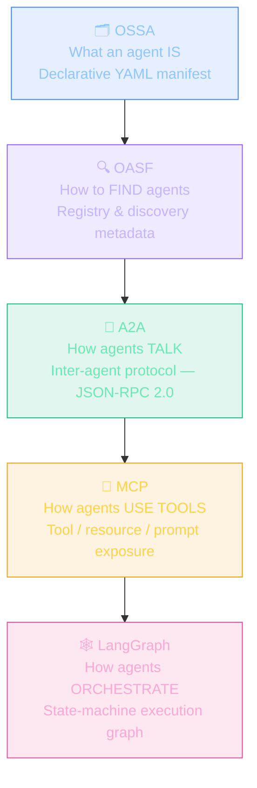
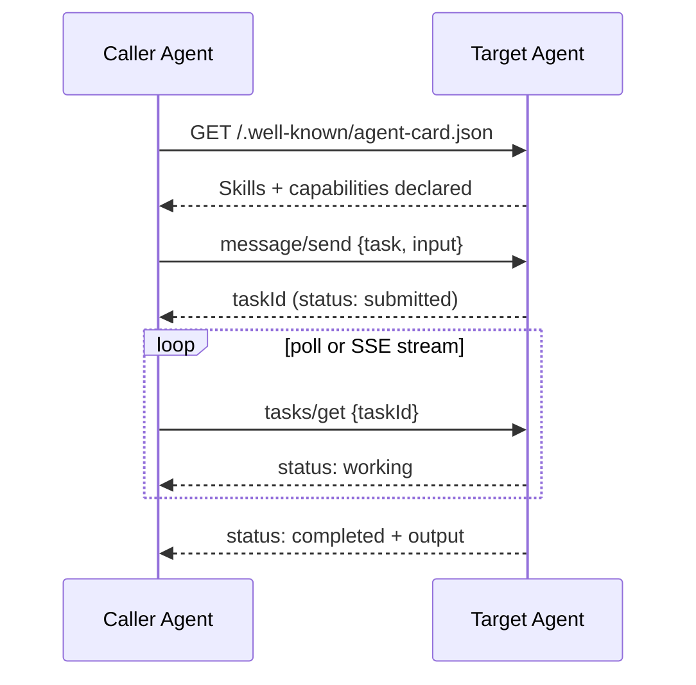
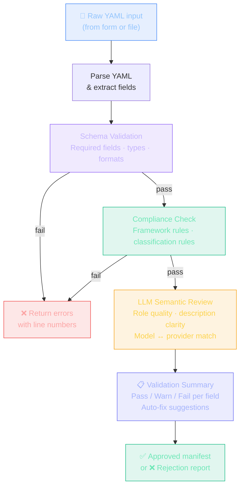
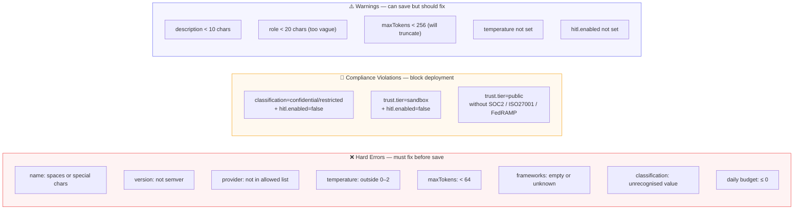
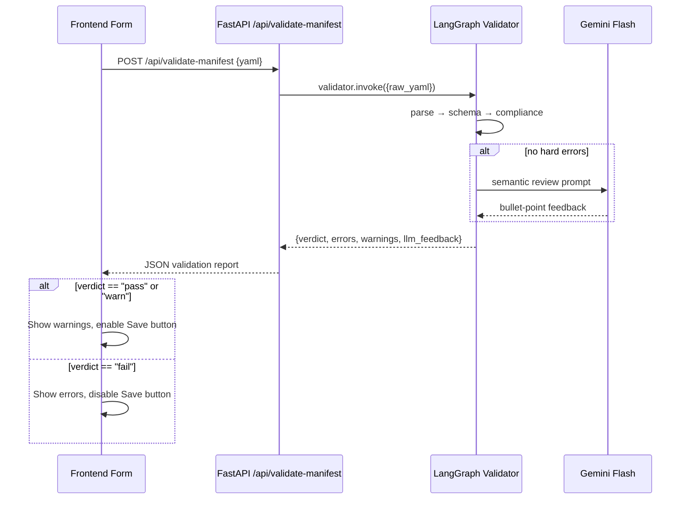
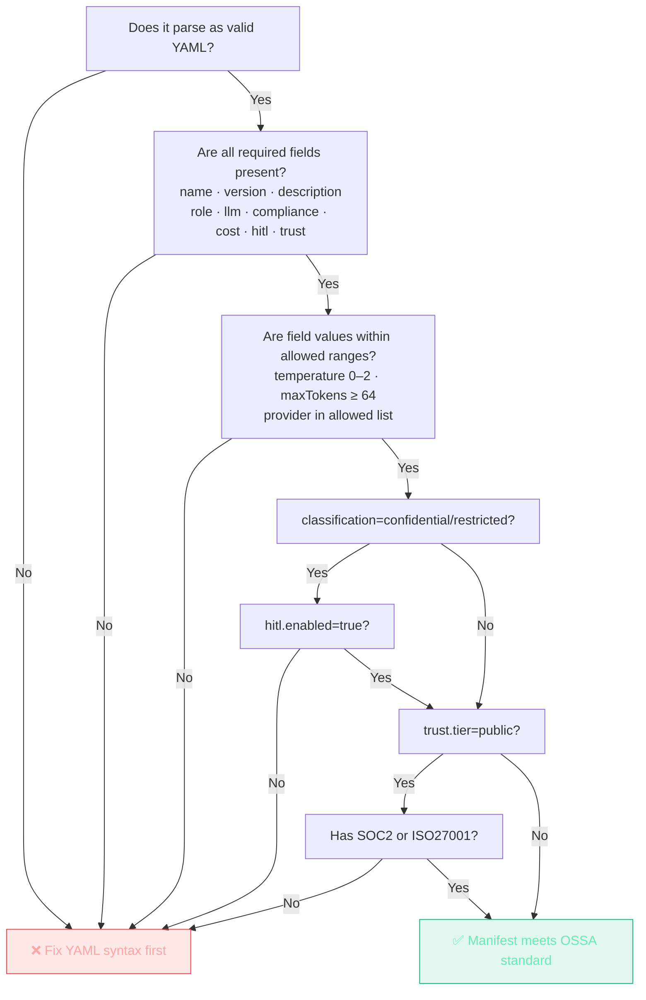

# OSSA Agent Standards — Definitions & LangGraph Validation

> How agent standards fit together, what each field in an OSSA manifest means, and how to use a LangGraph pipeline to check whether a manifest meets the standard before it is deployed.

---

## Part 1: The Agent Standards Landscape

Eight standards occupy distinct layers of the stack. They are complementary, not competing.



---

### OSSA — Open Standard for Software Agents

The "OpenAPI for agents." Defines what an agent **is** through a Kubernetes-style YAML manifest. Every agent that runs through the OSSA dashboard is backed by one of these files.

**Three resource kinds:**

| Kind | Purpose | Has LLM? |
|------|---------|----------|
| `Agent` | Autonomous, LLM-powered unit | ✅ Yes |
| `Task` | Deterministic step (script / API call) | ❌ No |
| `Workflow` | Composes agents + tasks with branching | Optional |

**Minimal valid manifest:**

```yaml
apiVersion: ossa/v0.5.x
kind: Agent
metadata:
  name: my-agent
  version: 1.0.0
  description: One sentence summary
spec:
  role: |
    You are a ... (system prompt)
  llm:
    provider: gemini          # gemini | openai | anthropic
    model: gemini-2.5-flash
    temperature: 0.2
    maxTokens: 2048
  compliance:
    frameworks: [SOC2]        # SOC2 | HIPAA | FedRAMP | ISO27001
    classification: internal  # public | internal | confidential | restricted
  cost:
    spendLimits:
      daily: 1.00             # USD — hard cap per day
  hitl:
    enabled: true             # human-in-the-loop approval gate
  trust:
    tier: org-verified        # sandbox | org-verified | public
```

---

### OASF — Open Agentic Schema Framework (Cisco / AGNTCY)

Focuses on **agent discovery and registry metadata** — not runtime execution. Think of it as the `package.json` for agents in a federated registry.

```json
{
  "name": "example.org/my-agent",
  "schema_version": "0.8.0",
  "version": "v1.0.0",
  "description": "Summarises documents using extractive and abstractive methods",
  "skills": [
    {"id": 101, "name": "natural_language_processing/summarisation"}
  ],
  "domains": [
    {"id": 202, "name": "technology/software_engineering"}
  ],
  "locators": [
    {"type": "docker_image", "url": "ghcr.io/example/my-agent:v1.0.0"}
  ]
}
```

Records are content-addressable (SHA-256 / CID). Discovery uses OCI registries + Kademlia DHT.

---

### A2A — Agent-to-Agent Protocol (Google / Linux Foundation)

Defines how one agent **calls another**. The declarative element is the **Agent Card**, published at `/.well-known/agent-card.json`.



Task lifecycle: `submitted → working → input-required → completed | failed | canceled`

Agent Card structure:
```json
{
  "name": "code-reviewer",
  "url": "https://agents.example.com/code-reviewer",
  "version": "1.0.0",
  "capabilities": {"streaming": true},
  "skills": [
    {
      "id": "review_pull_request",
      "name": "Review Pull Request",
      "description": "Analyses a PR diff for security, style, and logic issues",
      "tags": ["security", "code-quality"],
      "examples": ["Review PR #42 for SQL injection risks"]
    }
  ]
}
```

---

### MCP — Model Context Protocol (Anthropic)

Defines how an agent **exposes tools, resources, and prompts** to an LLM via JSON-RPC 2.0. Each tool requires `name` + `inputSchema`:

```json
{
  "name": "validate_manifest",
  "description": "Check an OSSA manifest for compliance and schema errors",
  "inputSchema": {
    "type": "object",
    "properties": {
      "manifest_yaml": {"type": "string", "description": "Raw YAML content of the manifest"},
      "strict": {"type": "boolean", "description": "Fail on warnings as well as errors"}
    },
    "required": ["manifest_yaml"]
  }
}
```

A single client can connect to **many MCP servers simultaneously** — each server adds a capability namespace.

---

### LangGraph — Orchestration Framework

LangGraph models agent logic as a **directed state graph** where each node is a function and edges carry state between them.

```python
from langgraph.graph import StateGraph, START, END

graph = StateGraph(AgentState)
graph.add_node("validate",  validate_node)
graph.add_node("llm_call",  llm_node)
graph.add_node("hitl_gate", hitl_node)
graph.add_node("audit",     audit_node)

graph.add_edge(START, "validate")
graph.add_conditional_edges("validate", route_after_validate,
    {"pass": "llm_call", "hitl": "hitl_gate", "fail": END})
graph.add_edge("llm_call", "audit")
graph.add_edge("hitl_gate", "llm_call")
graph.add_edge("audit", END)

app = graph.compile(checkpointer=InMemorySaver())
```

Key patterns:
- **Supervisor** — one LLM routes tasks to specialised worker agents
- **Subgraph** — an entire graph embedded as a single node in a parent graph
- **Command** — a node returns `Command(update=..., goto=...)` for dynamic routing
- **Checkpointer** — saves full state at every superstep; enables pause/resume and time-travel

---

### Comparative Summary

| Standard | Format | Primary role | Composition | Maturity |
|----------|--------|-------------|-------------|---------|
| OSSA | YAML | Manifest — defines what an agent is | ✅ Workflow kind, swarm topology | Early v0.5.x |
| OASF | JSON / Protobuf | Registry — how to find agents | ⚠️ Registry-level only | Growing v0.8.0 |
| A2A | JSON-RPC / Protobuf | Protocol — how agents communicate | ✅ Native multi-agent messaging | Mature v1.0 |
| MCP | JSON-RPC | Protocol — how agents use tools | ⚠️ Multi-server connections | Mature |
| LangGraph | Python code | Framework — how agents are orchestrated | ✅ Subgraphs, supervisors | Mature |
| K8s CRDs | YAML | Infrastructure — serving and isolation | ✅ Inference graphs, pipelines | Varies |

---

## Part 2: OSSA Manifest Field Reference

Every field in the manifest has a specific meaning and validation rule.

```mermaid
graph LR
  subgraph Manifest["OSSA Manifest"]
    M["metadata\nname · version · description"]
    S["spec.llm\nprovider · model · temp · maxTokens"]
    C["spec.compliance\nframeworks · classification"]
    CO["spec.cost\ndaily spend limit"]
    H["spec.hitl\nenabled · trigger conditions"]
    T["spec.trust\ntier"]
  end

  M --> S --> C --> CO --> H --> T

  style Manifest fill:#0f172a,stroke:#334155
  style M fill:#3b82f620,stroke:#3b82f6,color:#93c5fd
  style S fill:#8b5cf620,stroke:#8b5cf6,color:#c4b5fd
  style C fill:#10b98120,stroke:#10b981,color:#6ee7b7
  style CO fill:#f59e0b20,stroke:#f59e0b,color:#fcd34d
  style H fill:#fb923c20,stroke:#fb923c,color:#fdba74
  style T fill:#ec489920,stroke:#ec4899,color:#f9a8d4
```



### `metadata`

| Field | Type | Required | Rule |
|-------|------|----------|------|
| `name` | string | ✅ | Lowercase alphanumeric + hyphens only. No spaces. |
| `version` | string | ✅ | Semver format: `MAJOR.MINOR.PATCH` |
| `description` | string | ✅ | 10–500 characters. Human-readable summary. |

### `spec.llm`

| Field | Type | Required | Rule |
|-------|------|----------|------|
| `provider` | enum | ✅ | `gemini` · `openai` · `anthropic` |
| `model` | string | ✅ | Must be a valid model ID for the chosen provider |
| `temperature` | float | ✅ | `0.0` – `2.0`. Deterministic = `0.0`, creative = `1.0+` |
| `maxTokens` | integer | ✅ | `64` – `32000`. Caps the LLM output per call. |

### `spec.compliance`

| Field | Type | Required | Rule |
|-------|------|----------|------|
| `frameworks` | string[] | ✅ | At least one of: `SOC2`, `HIPAA`, `FedRAMP`, `ISO27001`, `GDPR` |
| `classification` | enum | ✅ | `public` · `internal` · `confidential` · `restricted` |

> **Rule:** `confidential` or `restricted` data classification **requires** `hitl.enabled: true`.

### `spec.cost`

| Field | Type | Required | Rule |
|-------|------|----------|------|
| `spendLimits.daily` | float | ✅ | USD. Must be > 0. Recommended max: `$10` for org-verified agents. |

### `spec.hitl`

| Field | Type | Required | Rule |
|-------|------|----------|------|
| `enabled` | boolean | ✅ | `true` means a human must approve before each execution proceeds. |

### `spec.trust.tier`

| Value | Meaning | Constraint |
|-------|---------|-----------|
| `sandbox` | Untrusted / experimental | Must have `hitl.enabled: true` |
| `org-verified` | Internal, reviewed | Daily budget ≤ $10 recommended |
| `public` | Externally exposed | Requires `SOC2` or equivalent framework |

---

## Part 3: Using LangGraph to Validate an OSSA Manifest

Before a manifest is saved and deployed, a LangGraph validation pipeline can check every field, surface errors with explanations, and optionally auto-fix common issues.

### The Validation Pipeline



### LangGraph State Definition

```python
from typing import TypedDict, Annotated
import operator

class ValidationState(TypedDict):
    raw_yaml: str                    # input from the user
    parsed: dict                     # parsed YAML fields
    schema_errors: list[str]         # hard failures (missing fields, wrong types)
    schema_warnings: list[str]       # soft issues (low token budget, no description)
    compliance_errors: list[str]     # compliance rule violations
    llm_feedback: str                # LLM semantic review result
    auto_fixes: dict                 # suggested field corrections
    verdict: str                     # "pass" | "warn" | "fail"
```

### Node Implementations

```python
import yaml
from langgraph.graph import StateGraph, START, END

# ── Node 1: Parse ─────────────────────────────────────────────────────
def parse_node(state: ValidationState) -> ValidationState:
    try:
        parsed = yaml.safe_load(state["raw_yaml"])
        return {**state, "parsed": parsed or {}}
    except yaml.YAMLError as e:
        return {**state, "parsed": {}, "schema_errors": [f"YAML parse error: {e}"]}

# ── Node 2: Schema Validation ─────────────────────────────────────────
VALID_PROVIDERS = {"gemini", "openai", "anthropic"}
VALID_FRAMEWORKS = {"SOC2", "HIPAA", "FedRAMP", "ISO27001", "GDPR"}
VALID_TIERS = {"sandbox", "org-verified", "public"}
VALID_CLASSIFICATIONS = {"public", "internal", "confidential", "restricted"}

def schema_node(state: ValidationState) -> ValidationState:
    m = state["parsed"]
    errors, warnings = [], []

    # Required top-level fields
    for field in ("apiVersion", "kind", "metadata", "spec"):
        if field not in m:
            errors.append(f"Missing required field: '{field}'")

    meta = m.get("metadata", {})
    spec = m.get("spec", {})
    llm  = spec.get("llm", {})
    comp = spec.get("compliance", {})
    cost = spec.get("cost", {})
    hitl = spec.get("hitl", {})
    trust = spec.get("trust", {})

    # metadata
    if not meta.get("name"):
        errors.append("metadata.name is required")
    elif not all(c.isalnum() or c == '-' for c in meta["name"]):
        errors.append("metadata.name must be lowercase alphanumeric and hyphens only")

    if not meta.get("version"):
        errors.append("metadata.version is required (semver: MAJOR.MINOR.PATCH)")

    if not meta.get("description"):
        warnings.append("metadata.description is empty — add a human-readable summary")
    elif len(meta["description"]) < 10:
        warnings.append("metadata.description is very short (< 10 chars)")

    # spec.role
    if not spec.get("role"):
        errors.append("spec.role is required — this is the agent's system prompt")
    elif len(spec["role"].strip()) < 20:
        warnings.append("spec.role is very short — describe the agent's behaviour more fully")

    # spec.llm
    if not llm:
        errors.append("spec.llm is required")
    else:
        if llm.get("provider") not in VALID_PROVIDERS:
            errors.append(f"spec.llm.provider must be one of {VALID_PROVIDERS}")
        if not llm.get("model"):
            errors.append("spec.llm.model is required")
        temp = llm.get("temperature")
        if temp is None:
            warnings.append("spec.llm.temperature not set — defaulting to 0.7")
        elif not (0.0 <= float(temp) <= 2.0):
            errors.append("spec.llm.temperature must be 0.0–2.0")
        max_tok = llm.get("maxTokens", 0)
        if max_tok < 64:
            errors.append("spec.llm.maxTokens must be ≥ 64")
        elif max_tok < 256:
            warnings.append("spec.llm.maxTokens < 256 — very low; responses will truncate")

    # spec.compliance
    frameworks = comp.get("frameworks", [])
    if not frameworks:
        errors.append("spec.compliance.frameworks must list at least one framework")
    else:
        unknown = set(frameworks) - VALID_FRAMEWORKS
        if unknown:
            errors.append(f"Unknown compliance frameworks: {unknown}")

    if comp.get("classification") not in VALID_CLASSIFICATIONS:
        errors.append(f"spec.compliance.classification must be one of {VALID_CLASSIFICATIONS}")

    # spec.cost
    daily = cost.get("spendLimits", {}).get("daily", 0)
    if daily <= 0:
        errors.append("spec.cost.spendLimits.daily must be > 0")

    # spec.hitl
    if "enabled" not in hitl:
        warnings.append("spec.hitl.enabled not set — defaulting to false")

    # spec.trust
    tier = trust.get("tier")
    if tier and tier not in VALID_TIERS:
        errors.append(f"spec.trust.tier must be one of {VALID_TIERS}")

    return {**state, "schema_errors": errors, "schema_warnings": warnings}

# ── Node 3: Compliance Rules ──────────────────────────────────────────
def compliance_node(state: ValidationState) -> ValidationState:
    m = state["parsed"]
    spec = m.get("spec", {})
    comp = spec.get("compliance", {})
    hitl = spec.get("hitl", {})
    trust = spec.get("trust", {})
    errors = list(state["compliance_errors"])

    classification = comp.get("classification", "")
    hitl_enabled   = hitl.get("enabled", False)
    tier           = trust.get("tier", "")

    # Rule: confidential/restricted data requires HITL
    if classification in ("confidential", "restricted") and not hitl_enabled:
        errors.append(
            f"COMPLIANCE VIOLATION: classification='{classification}' requires hitl.enabled=true"
        )

    # Rule: sandbox tier requires HITL
    if tier == "sandbox" and not hitl_enabled:
        errors.append(
            "COMPLIANCE VIOLATION: trust.tier='sandbox' requires hitl.enabled=true"
        )

    # Rule: public tier requires SOC2 or equivalent
    if tier == "public":
        frameworks = comp.get("frameworks", [])
        if not any(f in frameworks for f in ("SOC2", "ISO27001", "FedRAMP")):
            errors.append(
                "COMPLIANCE VIOLATION: trust.tier='public' requires SOC2, ISO27001, or FedRAMP"
            )

    return {**state, "compliance_errors": errors}

# ── Node 4: LLM Semantic Review ───────────────────────────────────────
def llm_review_node(state: ValidationState) -> ValidationState:
    from google import genai
    client = genai.Client()  # uses ADC

    m = state["parsed"]
    spec = m.get("spec", {})
    meta = m.get("metadata", {})

    prompt = f"""You are an OSSA manifest reviewer. Review this agent manifest for quality.

Agent name: {meta.get('name')}
Description: {meta.get('description')}
System role (first 300 chars): {str(spec.get('role', ''))[:300]}
Provider: {spec.get('llm', {}).get('provider')}
Model: {spec.get('llm', {}).get('model')}
Compliance: {spec.get('compliance', {}).get('frameworks')}

Check:
1. Is the system role clear and specific about what the agent does?
2. Does the description match the role?
3. Is the chosen model appropriate for the declared compliance frameworks?
   (e.g. GPT-4 with HIPAA requires Azure OpenAI, not the public API)
4. Any obvious red flags?

Respond in 3-5 bullet points. Be concise."""

    response = client.models.generate_content(
        model="gemini-2.5-flash",
        contents=prompt,
    )
    return {**state, "llm_feedback": response.text}

# ── Node 5: Summarise ─────────────────────────────────────────────────
def summary_node(state: ValidationState) -> ValidationState:
    has_errors = bool(state["schema_errors"] or state["compliance_errors"])
    has_warnings = bool(state["schema_warnings"])
    verdict = "fail" if has_errors else "warn" if has_warnings else "pass"
    return {**state, "verdict": verdict}

# ── Routing logic ─────────────────────────────────────────────────────
def route_after_schema(state: ValidationState) -> str:
    if state["schema_errors"]:
        return "fail"
    return "compliance"

def route_after_compliance(state: ValidationState) -> str:
    if state["compliance_errors"]:
        return "fail"
    return "llm_review"
```

### Assembling the Graph

```python
graph = StateGraph(ValidationState)

graph.add_node("parse",       parse_node)
graph.add_node("schema",      schema_node)
graph.add_node("compliance",  compliance_node)
graph.add_node("llm_review",  llm_review_node)
graph.add_node("summary",     summary_node)

graph.add_edge(START,       "parse")
graph.add_edge("parse",     "schema")
graph.add_conditional_edges("schema",     route_after_schema,
    {"fail": "summary", "compliance": "compliance"})
graph.add_conditional_edges("compliance", route_after_compliance,
    {"fail": "summary", "llm_review": "llm_review"})
graph.add_edge("llm_review", "summary")
graph.add_edge("summary",    END)

validator = graph.compile()
```

### Running the Validator

```python
result = validator.invoke({
    "raw_yaml": """
apiVersion: ossa/v0.5.x
kind: Agent
metadata:
  name: my agent          # ← error: spaces not allowed
  version: 1.0.0
  description: Helps with code review
spec:
  role: You are a helpful assistant.  # ← warning: too vague
  llm:
    provider: gemini
    model: gemini-2.5-flash
    temperature: 0.2
    maxTokens: 2048
  compliance:
    frameworks: [SOC2]
    classification: confidential      # ← triggers HITL rule
  cost:
    spendLimits:
      daily: 1.00
  hitl:
    enabled: false                    # ← COMPLIANCE VIOLATION
  trust:
    tier: org-verified
""",
    "parsed": {},
    "schema_errors": [],
    "schema_warnings": [],
    "compliance_errors": [],
    "llm_feedback": "",
    "auto_fixes": {},
    "verdict": "",
})

print(f"Verdict: {result['verdict']}")
print(f"Schema errors:      {result['schema_errors']}")
print(f"Schema warnings:    {result['schema_warnings']}")
print(f"Compliance errors:  {result['compliance_errors']}")
print(f"LLM feedback:\n{result['llm_feedback']}")
```

**Expected output:**

```
Verdict: fail
Schema errors:      ["metadata.name must be lowercase alphanumeric and hyphens only"]
Schema warnings:    ["spec.role is very short — describe the agent's behaviour more fully"]
Compliance errors:  ["COMPLIANCE VIOLATION: classification='confidential' requires hitl.enabled=true"]
LLM feedback:
• The system role 'You are a helpful assistant' is too generic — it does not constrain
  behaviour, which is a risk for a confidential-data agent.
• The description 'Helps with code review' doesn't mention what languages or frameworks
  are in scope.
• gemini-2.5-flash is suitable for SOC2 workloads when used via Vertex AI ADC.
• Fix the name and HITL settings before deploying this manifest.
```

---

## Part 4: Validation Rules at a Glance



---

## Part 5: Integrating the Validator Into the Dashboard

The validator runs as a FastAPI endpoint and is called by the frontend before the manifest is saved.



**Backend endpoint:**

```python
@app.post("/api/validate-manifest")
async def validate_manifest(payload: dict):
    raw_yaml = payload.get("yaml", "")
    if not raw_yaml.strip():
        raise HTTPException(400, "No YAML provided")

    result = validator.invoke({
        "raw_yaml": raw_yaml,
        "parsed": {}, "schema_errors": [], "schema_warnings": [],
        "compliance_errors": [], "llm_feedback": "", "auto_fixes": {}, "verdict": "",
    })

    return {
        "verdict":           result["verdict"],          # "pass" | "warn" | "fail"
        "schema_errors":     result["schema_errors"],
        "schema_warnings":   result["schema_warnings"],
        "compliance_errors": result["compliance_errors"],
        "llm_feedback":      result["llm_feedback"],
    }
```

**Frontend usage (in NewAgentModal before saving):**

```typescript
async function validateBeforeSave(yamlString: string) {
  const res = await fetch('/api/validate-manifest', {
    method: 'POST',
    headers: { 'Content-Type': 'application/json' },
    body: JSON.stringify({ yaml: yamlString }),
  })
  const report = await res.json()

  if (report.verdict === 'fail') {
    setValidationErrors(report.schema_errors.concat(report.compliance_errors))
    return false   // block save
  }
  if (report.verdict === 'warn') {
    setValidationWarnings(report.schema_warnings)
    setLlmFeedback(report.llm_feedback)
    return true    // allow save with warnings shown
  }
  return true      // clean pass
}
```

---

## Quick Reference: Does My Manifest Meet the Standard?


