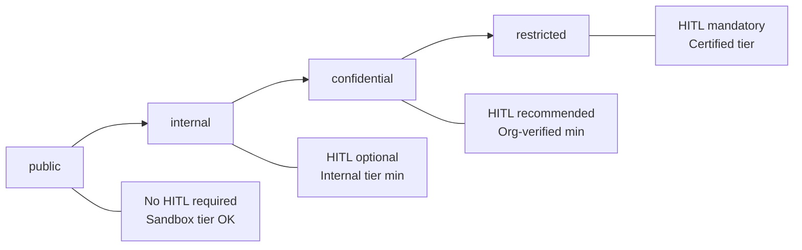

# Compliance Frameworks

## Why Compliance is Built Into OSSA

Traditional AI integrations treat compliance as an afterthought — a checklist added after the system is built. OSSA embeds compliance directly into the **agent manifest**, making it impossible to run an agent without declaring its compliance posture.

Every agent must declare:
- Which frameworks it operates under (`compliance.frameworks`)
- What data classification it handles (`compliance.classification`)
- What trust tier it belongs to (`trust_tier`)

These declarations are validated at execution time, captured in every audit record, and enforced by the governance pipeline.

---

## Supported Frameworks

### HIPAA — Health Insurance Portability and Accountability Act

**Scope:** Any agent that processes, stores, or transmits Protected Health Information (PHI).

**What OSSA enforces when HIPAA is declared:**

| Control | OSSA Implementation |
|---|---|
| Access controls | `trust_tier: org-verified` or `certified` required |
| Audit logging | Every execution captured with full input/output |
| Minimum necessary standard | Input reviewed at HITL gate before LLM sees PHI |
| Breach prevention | `hitl_enabled: true` strongly recommended |
| Data classification | Must be `confidential` or `restricted` |

**Manifest example:**
```yaml
compliance:
  frameworks: [HIPAA]
  classification: confidential
hitl_enabled: true
trust_tier: org-verified
```

**Risk if violated:** OCR fines up to $1.9M per violation category per year (2024 limits).

---

### SOC2 — System and Organisation Controls 2

**Scope:** Agents used in SaaS products or internal systems where trust service criteria apply.

**Five Trust Service Criteria (TSC):**

| Criteria | OSSA Control |
|---|---|
| Security | Manifest schema validation, provider allowlist |
| Availability | Budget limits prevent runaway spend/DoS |
| Processing Integrity | Audit log proves data was processed correctly |
| Confidentiality | Data classification + HITL gate |
| Privacy | Configurable retention, audit trail |

**SOC2 Type II** requires demonstrating controls work consistently over time — the OSSA audit log provides the continuous evidence needed for Type II audits.

**Manifest example:**
```yaml
compliance:
  frameworks: [SOC2]
  classification: internal
```

---

### GDPR — General Data Protection Regulation

**Scope:** Any agent handling personal data of EU/EEA residents.

**Key requirements OSSA addresses:**

| Requirement | OSSA Control |
|---|---|
| Purpose limitation | System role defines exact permitted use |
| Data minimisation | Input reviewed at HITL before processing |
| Right to erasure | Execution IDs enable targeted audit record deletion |
| Accountability | Complete audit trail per Article 5(2) |
| Data Protection by Design | Compliance declared in manifest, not added later |

**Manifest example:**
```yaml
compliance:
  frameworks: [GDPR]
  classification: restricted
hitl_enabled: true
```

---

### PCI-DSS — Payment Card Industry Data Security Standard

**Scope:** Agents that handle cardholder data (CHD) or sensitive authentication data (SAD).

**Applicable requirements:**

| PCI-DSS Requirement | OSSA Mapping |
|---|---|
| Req 7: Restrict access | `trust_tier: certified`, HITL mandatory |
| Req 10: Log and monitor | Full audit capture per execution |
| Req 12: Security policy | Manifest-as-code = documented policy |

**Warning:** Never pass raw card numbers (PAN) as agent input without tokenisation. OSSA audit logs capture full input — classify as `restricted` and restrict log access.

---

### Multi-Framework Agents

Agents can declare multiple frameworks simultaneously:

```yaml
compliance:
  frameworks: [HIPAA, SOC2, GDPR]
  classification: confidential
```

OSSA applies the **most restrictive** controls across all declared frameworks. In the above example:
- HITL is effectively mandatory (HIPAA requirement)
- Trust tier must be `org-verified` or above
- Full audit capture required

---

## Data Classification

Every manifest must specify a `classification` level for the data the agent handles:

| Level | Description | Typical Use |
|---|---|---|
| `public` | No sensitivity — freely shareable | Public FAQ bot, open data summariser |
| `internal` | Internal company use only | Code review, internal docs Q&A |
| `confidential` | Business-sensitive, restricted sharing | Customer data, financial records |
| `restricted` | Highest sensitivity, tightly controlled | PHI, PAN, credentials, legal matter |

**Classification affects:**
- Audit log access controls
- Recommended HITL setting
- Required trust tier minimum



---

## Adding Custom Compliance Frameworks

OSSA supports custom compliance frameworks for internal policies, industry-specific standards, or regional regulations not in the built-in list.

In the **Edit Agent** modal → **Compliance Frameworks** → **⚙ Add Custom**:

```json
{
  "id": "NIST-AI-RMF",
  "name": "NIST AI RMF",
  "fullName": "NIST Artificial Intelligence Risk Management Framework",
  "description": "US NIST framework for managing risks in AI systems across the full lifecycle.",
  "keyRequirements": [
    "Govern: Policies and accountability for AI risk",
    "Map: Categorise AI risks in context",
    "Measure: Analyse and assess AI risks",
    "Manage: Prioritise and treat identified risks"
  ],
  "scope": "US Federal and enterprise AI systems",
  "docsUrl": "https://airc.nist.gov/RMF",
  "color": "#60a5fa",
  "bg": "rgba(59,130,246,0.1)"
}
```

Custom frameworks are saved to browser storage and available across all agents in that session.
