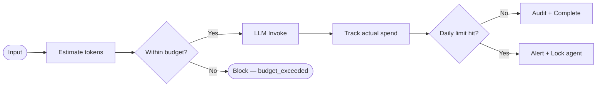

# Cost Governance

## Why Cost Governance Matters

LLM API costs are variable and can spike unpredictably. A single malformed prompt or runaway agent can consume hundreds of dollars in a day. OSSA enforces cost limits **before** the LLM is called, not after.

Cost governance in OSSA operates at two levels:
1. **Per-execution** — token budget per run
2. **Per-day** — daily spend cap per agent

---

## How It Works



After execution, actual token usage is captured and compared against limits. If the daily cap is reached, the agent is locked until the next calendar day.

---

## Configuration

```yaml
cost:
  daily: 2.0              # max USD per day for this agent
  alert_threshold: 0.8    # alert when 80% of daily budget consumed

max_tokens: 1024          # hard cap on output tokens per execution
```

**`cost.daily`** — The maximum USD the agent is permitted to spend per day across all executions. Default: `$1.00`.

**`cost.alert_threshold`** — When spend reaches this fraction of the daily limit, a warning is shown in the dashboard. Default: `0.8` (80%).

**`max_tokens`** — Hard cap on the number of output tokens the LLM can return per execution. This directly controls the per-execution cost ceiling.

---

## Provider Pricing Reference

| Provider | Model | Input (per 1K tokens) | Output (per 1K tokens) |
|---|---|---|---|
| Gemini | gemini-2.5-flash | $0.00015 | $0.0006 |
| Gemini | gemini-1.5-pro | $0.00125 | $0.005 |
| Anthropic | claude-haiku-4-5 | $0.0008 | $0.004 |
| Anthropic | claude-sonnet-4-6 | $0.003 | $0.015 |
| Anthropic | claude-opus-4-7 | $0.015 | $0.075 |
| OpenAI | gpt-4o-mini | $0.00015 | $0.0006 |
| OpenAI | gpt-4o | $0.0025 | $0.01 |

> Prices are approximate. Always check provider documentation for current rates.

---

## Cost Estimation Example

For a `code-developer` agent with a 300-token input:

| Item | Tokens | Rate | Cost |
|---|---|---|---|
| Input | 300 | $0.00015 / 1K | $0.000045 |
| System role (approx) | 150 | $0.00015 / 1K | $0.0000225 |
| Output (max_tokens=1024) | 1024 | $0.0006 / 1K | $0.0006144 |
| **Total estimated** | **1474** | | **$0.000682** |

At this rate, the `$1.00` daily budget allows approximately **1,466 executions per day** before hitting the cap.

---

## The Cost Dashboard Panel

The **Live Metrics** panel (bottom-right of the dashboard) shows real-time cost data:

| Metric | Source |
|---|---|
| **Estimated Cost** | Calculated from actual token counts × provider rates |
| **Total Tokens** | Input + output tokens used in this execution |
| **Provider** | Which LLM was called |
| **Daily Budget** | From `cost.daily` in the manifest |
| **% Used** | Running daily spend ÷ daily limit |

The budget bar fills from left to right as daily spend increases. At `alert_threshold` (default 80%), it turns amber. At 100%, executions are blocked.

---

## Cost Event in the SSE Stream

After execution completes, a `cost_update` event is emitted:

```json
{
  "type": "cost_update",
  "data": {
    "provider": "gemini",
    "tokens": {
      "input": 412,
      "output": 198,
      "total": 610
    },
    "cost": {
      "estimated_usd": 0.000183,
      "input_price_per_1k": 0.00015,
      "output_price_per_1k": 0.0006
    }
  }
}
```

This is captured in the audit log alongside the execution record.

---

## Cost Optimisation Tips

| Strategy | Impact |
|---|---|
| Use `gemini-2.5-flash` for routine tasks | ~5× cheaper than pro models |
| Set `max_tokens` conservatively | Directly caps per-execution cost |
| Use `temperature: 0.1–0.3` for structured tasks | Fewer retries needed |
| Write concise system roles | Reduces input tokens on every call |
| Enable HITL for large inputs | Human review prevents expensive low-quality runs |
| Use `sandbox` tier with low budgets for dev | Separate budget from production agents |

---

## Budget Governance by Trust Tier

| Trust Tier | Recommended Daily Limit | Max Tokens / Run |
|---|---|---|
| `sandbox` | $0.10 | 512 |
| `internal` | $1.00 | 1024 |
| `org-verified` | $5.00 | 2048 |
| `certified` | $25.00 | 4096 |

These are recommendations, not hard limits. OSSA does not automatically cap by tier — the limits in your manifest are authoritative.
