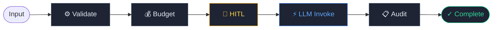
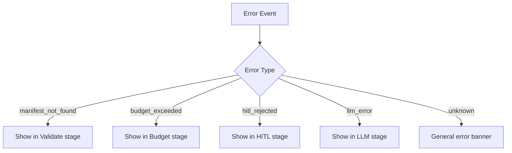

# OSSA Execution Pipeline

## Overview

Every agent execution in OSSA passes through a fixed 6-stage governance pipeline before a response is returned. No stage can be skipped. Each stage produces an audit event streamed in real time to the dashboard.



---

## Stage 1 — Validate

**What it does:** Loads and validates the agent's YAML manifest against the OSSA v0.5 schema.

**Checks performed:**
- Manifest file exists and is valid YAML
- All required fields present (`name`, `version`, `provider`, `model`, `compliance`)
- Provider and model are in the approved registry
- Data classification is a valid enum value
- Trust tier is recognised

**Failure:** Returns `400 Bad Request` before any LLM call is made. No cost incurred.

**SSE event:** None (implicit — any subsequent event confirms validation passed)

---

## Stage 2 — Budget

**What it does:** Checks cost limits before the LLM is invoked.

**Checks performed:**
- Estimated token usage vs `token_budget_per_execution`
- Running daily spend vs `cost.daily` limit
- Provider pricing lookup (per-1k-token rates)

**Failure:** Execution blocked with `budget_exceeded` error. No LLM call made.

**SSE event:** `cost_update` — sent after execution with actual spend

```json
{
  "type": "cost_update",
  "data": {
    "tokens": { "input": 412, "output": 198, "total": 610 },
    "cost": { "estimated_usd": 0.000183, "input_price_per_1k": 0.00015, "output_price_per_1k": 0.0006 }
  }
}
```

---

## Stage 3 — HITL Gate

**What it does:** If `hitl_enabled: true`, pauses execution and waits for human approval.

**Flow:**
1. Pipeline emits `hitl_required` SSE event
2. Dashboard shows ⏳ Awaiting supervisor banner
3. Supervisor clicks **Approve** → `POST /api/agent/approve`
4. Pipeline emits `hitl_approved` and continues

**If skipped:** `hitl_enabled: false` — pipeline proceeds directly to LLM Invoke. Stage shows as `—` (skipped) in the dashboard.

See [HITL Guide](hitl-guide.md) for full details.

---

## Stage 4 — LLM Invoke

**What it does:** Sends the input to the configured LLM provider and streams the response.

**Data sent to provider:**
- System prompt (from `role` field in manifest)
- User input
- Provider-specific parameters (`temperature`, `max_tokens`)

**Streaming:** Response arrives as `response_chunk` SSE events — each chunk appends to the live response in the dashboard.

```json
{ "type": "response_chunk", "data": { "chunk": "The function should be refactored..." } }
```

**Supported providers:**

| Provider | Models |
|---|---|
| `gemini` | gemini-2.5-flash, gemini-2.0-flash, gemini-1.5-pro |
| `anthropic` | claude-opus-4, claude-sonnet-4-5, claude-haiku-4-5 |
| `openai` | gpt-4o, gpt-4o-mini, o3-mini |

---

## Stage 5 — Audit Capture

**What it does:** Writes the complete execution record to the audit log.

**What is captured:**

| Field | Value |
|---|---|
| `execution_id` | UUID — unique per run |
| `manifest_name` | Agent identifier |
| `timestamp` | ISO 8601 UTC |
| `input` | Full user input |
| `response` | Full LLM response |
| `tokens` | Input / output / total counts |
| `cost_usd` | Estimated spend |
| `hitl_approved_by` | Supervisor ID (if HITL enabled) |
| `compliance_frameworks` | From manifest |
| `data_classification` | From manifest |

**Why this matters:** The audit log is the chain of evidence for compliance investigations. Under HIPAA, you must be able to produce a complete log of every AI interaction that touched PHI. OSSA's audit stage makes this automatic.

---

## Stage 6 — Complete

**What it does:** Marks execution as done, emits final event, closes SSE connection.

```json
{
  "type": "execution_complete",
  "data": {
    "response": "Full response text...",
    "cost_summary": { ... },
    "execution_id": "uuid"
  }
}
```

**Artifacts:** After completion you can download the result as:
- `.md` — Markdown formatted response
- `.json` — Full execution record including audit fields

---

## SSE Event Reference

| Event Type | Stage | Description |
|---|---|---|
| `execution_status` | 1–2 | Pipeline running, status update |
| `hitl_required` | 3 | Waiting for supervisor approval |
| `hitl_approved` | 3 | Approval received, proceeding |
| `response_chunk` | 4 | Streaming LLM output fragment |
| `cost_update` | 5 | Token and cost data |
| `execution_complete` | 6 | All done, full response available |
| `error` | Any | Pipeline failed — see `data.error` for reason |

---

## Error Handling



All errors stop the pipeline immediately. No subsequent stages run. The partial audit record (up to the failed stage) is still written.
