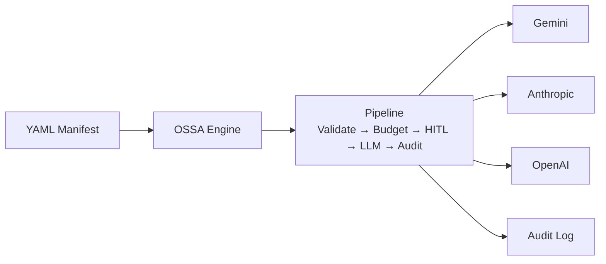

# Getting Started with OSSA

## What is OSSA?

**OSSA (Open Standard for Service Agents)** is a governance framework for enterprise AI agents. It defines a standard way to declare, deploy, and audit AI agents so that every execution is:

- **Compliant** — HIPAA, SOC2, GDPR, PCI-DSS enforced at runtime
- **Auditable** — complete record of every input, output, token, and cost
- **Governed** — human approval gates, cost limits, trust tiers
- **Vendor-neutral** — switch between Gemini, Claude, GPT by changing one YAML line

---

## Quick Start — Run Your First Agent

### 1. Open the Dashboard

Navigate to `http://10.100.15.44:3001`

### 2. Select an Agent

From the **Agents** sidebar on the left, click any agent card. The right panel shows the agent's details — provider, model, compliance frameworks, cost limits.

### 3. Review What the Agent Does

Click **"What this agent does ▾"** to expand the capability card. This shows:
- The system role (the instructions the LLM receives)
- Provider, model, temperature, and token settings
- Daily budget

### 4. Get AI Prompt Suggestions

The **✦ AI Prompt Suggestions** section shows prompts tailored for this specific agent. Click **✦ Generate** to get Gemini-generated example prompts. Click any prompt to load it into the input box.

### 5. Run the Agent

Click **▶ Run Agent** or press `Ctrl+Enter`. Watch the **OSSA Pipeline** at the bottom of the screen animate through each stage.

### 6. Approve if HITL is Enabled

If the agent has `hitl_enabled: true`, the pipeline pauses at the **🔐 HITL Approval Gate**. An approval banner appears — click **Approve ✓** to proceed. The LLM is only invoked after approval.

### 7. Read the Response

The response streams in real time as the LLM generates it. After completion, you can:
- **Copy** the full response
- **Download as .md** — formatted markdown
- **Download as .json** — full execution record with audit fields
- **Share** via email

---

## Creating a New Agent

### Method 1 — AI Recommend (Easiest)

1. Click **+ New Agent** in the sidebar
2. Select the **✦ AI Recommend** tab
3. Describe what you need: *"I need an agent that reviews Python PRs for security issues"*
4. Click **✦ Get AI Recommendation**
5. Gemini analyses your request, matches existing agents, and if none fit, generates a complete manifest pre-filled in the form below
6. Review and edit the form
7. Click **Create Agent**

### Method 2 — From Template

1. Click **+ New Agent**
2. Select **⊞ From Template**
3. Browse by category (Security, Research, Code, Data)
4. Click a template — the form fills automatically
5. Adjust as needed and click **Create Agent**

### Method 3 — Custom (Full Control)

1. Click **+ New Agent**
2. Select **⊕ Custom**
3. Fill in:
   - **Agent Title** — display name
   - **Description** — what the agent does
   - **System Role** — click **✦ AI Generate** to auto-generate from description
   - **Provider + Model** — choose your LLM
   - **Compliance** — toggle applicable frameworks
   - **Cost limits** — daily budget and token cap
   - **HITL** — enable if handling sensitive data
4. In the **Mapped Requirements** section, click **✦ AI Fill** to generate compliance requirement mappings
5. Click **Create Agent**

---

## Editing an Existing Agent

1. Select the agent from the sidebar
2. Click the **Edit** button in the agent header
3. Modify any field — provider, model, compliance, cost limits, system role, requirements
4. Click **Save Changes** — changes take effect immediately on the next execution

---

## Understanding the Pipeline Display

The **OSSA Pipeline** bar at the bottom of the screen shows the current execution stage in real time:

| Stage | Icon | Meaning |
|---|---|---|
| Validate | ⚙ | Manifest loaded and validated |
| Budget | 💰 | Cost check passed |
| HITL | 🔐 | Human approval gate (if enabled) |
| LLM Invoke | ⚡ | Generating response |
| Audit | 📋 | Recording execution |
| Complete | ◎ | Done |

A **blinking** icon means that stage is currently active. A **✓** means it completed successfully.

---

## Theme Toggle

The **◐ / ◑** button in the top navigation switches between:

- **◐ OSSA** — Default dark theme (charcoal + blue/violet)
- **◑ Mastech** — Mastech design system (navy + teal)

Your choice persists across sessions.

---

## Documentation

Click **📚 Docs** in the top nav to open the documentation viewer. Available guides:

| Document | What it covers |
|---|---|
| Getting Started | This guide |
| HITL Guide | Human-in-the-Loop approval flow |
| Execution Pipeline | All 6 pipeline stages explained |
| Compliance Frameworks | HIPAA, SOC2, GDPR, PCI-DSS for agents |
| Cost Governance | Budget limits, pricing, optimisation |
| Manifest Reference | Every YAML field documented |
| Agent Standards | OSSA v0.5 spec, LangGraph validation |

---

## Key Concepts Glossary

| Term | Meaning |
|---|---|
| **Manifest** | YAML file defining an agent's complete configuration |
| **HITL** | Human-in-the-Loop — supervisor approval gate before LLM runs |
| **Trust Tier** | Risk classification: sandbox → internal → org-verified → certified |
| **SSE** | Server-Sent Events — how pipeline updates stream to the browser |
| **Execution ID** | UUID that uniquely identifies one run, used for audit lookup |
| **Token Budget** | Max LLM output tokens per execution — controls cost cap |
| **Daily Limit** | Max USD spend per day for one agent |
| **System Role** | The persistent instruction set the LLM receives on every call |
| **Requirements** | Compliance requirement IDs mapped to this agent's capabilities |
| **Data Classification** | Sensitivity level: public → internal → confidential → restricted |
