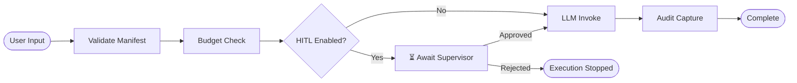
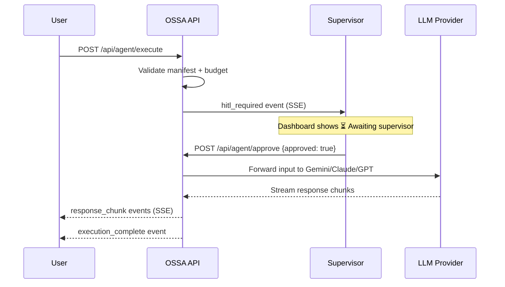

# Human-in-the-Loop (HITL)

## What is HITL?

**Human-in-the-Loop (HITL)** is an approval gate that pauses an AI agent's execution and requires a human supervisor to review and explicitly authorise it before the LLM is invoked.

Without HITL the agent pipeline runs fully autonomously — input → LLM → output. With HITL enabled, a checkpoint is inserted:



---

## Why HITL Exists

AI agents operating in enterprise environments can:

- Access sensitive or confidential data
- Generate responses that affect regulated processes (HIPAA, SOC2, PCI-DSS)
- Consume significant budget on a single long input
- Produce outputs that are cited in compliance records or customer-facing documents

HITL ensures a human reviews the **intent and scope** of the request before the LLM processes it. It is the primary control for **high-risk, high-trust** agent deployments.

---

## When HITL Triggers

HITL activates when **all three conditions** are true:

| Condition | Source |
|---|---|
| `hitl_enabled: true` in the manifest | Agent YAML file |
| Input is submitted for execution | User action |
| No prior approval exists for this execution ID | Runtime check |

The trigger is **per execution** — each run requires its own approval. Approvals do not carry over.

---

## HITL States in the Pipeline

| State | Icon | Meaning |
|---|---|---|
| `idle` | ⚙ | Agent not yet selected |
| `waiting` | ⏳ | Approval request sent, awaiting supervisor |
| `active` | 🔐 (blinking) | HITL gate reached, supervisor notified |
| `done` | ✓ | Approved — LLM execution proceeds |
| `skipped` | — | `hitl_enabled: false` — no gate |

---

## Configuring HITL in a Manifest

```yaml
name: security-auditor
version: "0.5.0"
description: Reviews code for OWASP Top 10 and compliance violations

hitl_enabled: true          # ← enables the approval gate
trust_tier: org-verified    # ← org-verified requires HITL by policy

provider: gemini
model: gemini-2.5-flash
```

To disable HITL for a non-sensitive agent:

```yaml
hitl_enabled: false
trust_tier: sandbox         # ← sandbox agents typically skip HITL
```

---

## The Approval Flow



---

## Rejection

If a supervisor rejects (or the gate times out), the execution stops:

- No LLM call is made
- No cost is incurred
- The event log records `hitl_rejected` with timestamp and supervisor ID
- The audit trail is complete — the rejection itself is a compliance record

---

## When to Enable HITL

| Use Case | HITL Recommended |
|---|---|
| Processing PHI / PII data | ✓ Yes |
| SOC2 or HIPAA regulated environments | ✓ Yes |
| Agents with `confidential` data classification | ✓ Yes |
| High daily budget (> $5/day) | ✓ Yes |
| Internal sandbox / developer testing | ✗ No |
| Read-only summarisation with public data | ✗ Optional |
| Automated CI/CD code review pipeline | ✗ No (use `sandbox` tier) |

---

## HITL and Trust Tiers

HITL is closely linked to the agent's `trust_tier`:

| Trust Tier | HITL Required by Policy |
|---|---|
| `sandbox` | Never |
| `internal` | Optional |
| `org-verified` | Recommended |
| `certified` | Mandatory |

An agent with `trust_tier: certified` and `hitl_enabled: false` will fail OSSA LangGraph validation with a **compliance violation**.

---

## API Reference

### Trigger execution (starts HITL wait if enabled)
```
POST /api/agent/execute
{ "manifest_name": "security-auditor", "input": "..." }
→ { "execution_id": "uuid", "status": "started" }
```

### Approve execution
```
POST /api/agent/approve
{ "execution_id": "uuid", "approved": true }
```

### Stream events (SSE)
```
GET /api/agent/events/{execution_id}
→ data: {"type": "hitl_required", ...}
→ data: {"type": "hitl_approved", ...}
→ data: {"type": "execution_complete", ...}
```
