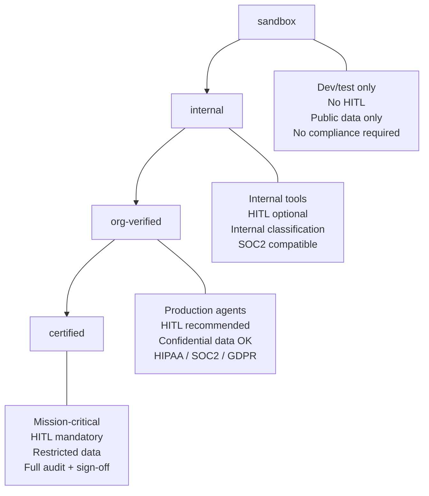

# OSSA Manifest Reference

## What is a Manifest?

An OSSA manifest is a **YAML file that defines everything about an agent** — its identity, the LLM it uses, its compliance posture, cost limits, and governance rules. It is the single source of truth for an agent's behaviour.

Manifests are stored as `.ossa.yaml` files. Every execution references a manifest by name. You can version-control manifests like code.

```
ossa/
└── backend/
    └── manifests/
        ├── code-analyzer.ossa.yaml
        ├── document-summarizer.ossa.yaml
        └── security-auditor.ossa.yaml
```

---

## Full Manifest Schema

```yaml
# ── Identity ─────────────────────────────────────────────────
name: security-auditor              # unique slug, used in API calls
version: "0.5.0"                   # OSSA spec version
description: >
  Reviews code and architecture for OWASP Top 10, CVEs,
  secrets exposure, and compliance violations.

# ── LLM Provider ─────────────────────────────────────────────
provider: gemini                   # gemini | anthropic | openai
model: gemini-2.5-flash            # model id from provider
temperature: 0.2                   # 0.0–2.0 — lower = more deterministic
max_tokens: 2048                   # max output tokens per response

# ── System Role ──────────────────────────────────────────────
role: |
  You are a senior security engineer specialised in OWASP Top 10,
  CVE analysis, and enterprise compliance.
  Your task is to:
  1. Identify security vulnerabilities with severity ratings
  2. Map findings to compliance frameworks (HIPAA, SOC2, PCI-DSS)
  3. Provide remediation guidance with code examples
  4. Flag secrets, credentials, and insecure configurations

# ── Compliance ────────────────────────────────────────────────
compliance:
  frameworks: [HIPAA, SOC2]        # declared compliance scope
  classification: confidential     # public | internal | confidential | restricted

# ── Cost Governance ───────────────────────────────────────────
cost:
  daily: 5.0                       # max USD spend per day for this agent
  alert_threshold: 0.8             # alert at 80% of daily budget

# ── Human-in-the-Loop ─────────────────────────────────────────
hitl_enabled: true                 # requires supervisor approval per execution

# ── Trust Tier ────────────────────────────────────────────────
trust_tier: org-verified           # sandbox | internal | org-verified | certified

# ── Requirements (mapped to standards) ───────────────────────
requirements:
  - id: SEC-01
    title: Input validation and sanitisation
    description: All inputs validated before LLM processing
    mapped: true
    confidence: 0.95
  - id: SEC-02
    title: Secrets detection in output
    description: Responses scanned for accidental credential exposure
    mapped: true
    confidence: 0.88
```

---

## Field Reference

### Identity Fields

| Field | Type | Required | Description |
|---|---|---|---|
| `name` | string | ✓ | Unique slug. Used in API (`/api/manifests/{name}`). Lowercase, hyphens only. |
| `version` | string | ✓ | OSSA spec version. Must be `"0.5.0"` or higher. |
| `description` | string | ✓ | One-paragraph description of the agent's purpose. |

### LLM Provider Fields

| Field | Type | Required | Default | Description |
|---|---|---|---|---|
| `provider` | enum | ✓ | — | `gemini`, `anthropic`, or `openai` |
| `model` | string | ✓ | — | Model identifier from the provider |
| `temperature` | float | ✗ | `0.3` | Randomness. `0.0` = deterministic, `2.0` = very creative |
| `max_tokens` | int | ✗ | `1024` | Maximum response length in tokens |

### System Role

| Field | Type | Required | Description |
|---|---|---|---|
| `role` | string | ✓ | System prompt sent to the LLM on every execution. Defines the agent's persona, task, and constraints. Use `✦ AI Generate` in the UI to auto-generate from description. |

### Compliance Fields

| Field | Type | Required | Description |
|---|---|---|---|
| `compliance.frameworks` | string[] | ✓ | List of compliance frameworks. Built-in: `HIPAA`, `SOC2`, `GDPR`, `PCI-DSS`. Custom frameworks can be added. |
| `compliance.classification` | enum | ✓ | `public` / `internal` / `confidential` / `restricted` |

### Cost Governance

| Field | Type | Required | Default | Description |
|---|---|---|---|---|
| `cost.daily` | float | ✗ | `1.0` | Maximum USD spend per calendar day. Execution blocked if exceeded. |
| `cost.alert_threshold` | float | ✗ | `0.8` | Fraction of daily budget at which to raise an alert (0.0–1.0). |

### Governance Fields

| Field | Type | Required | Default | Description |
|---|---|---|---|---|
| `hitl_enabled` | bool | ✓ | `false` | Whether each execution requires human approval before LLM is invoked. |
| `trust_tier` | enum | ✓ | — | `sandbox` / `internal` / `org-verified` / `certified` |

### Requirements

| Field | Type | Description |
|---|---|---|
| `requirements[].id` | string | Standard reference ID, e.g. `SEC-01`, `HIPAA-164.312.a` |
| `requirements[].title` | string | Short description of the requirement |
| `requirements[].description` | string | Detail of how this agent addresses the requirement |
| `requirements[].mapped` | bool | Whether the agent satisfies this requirement |
| `requirements[].confidence` | float | 0.0–1.0 confidence score for the mapping |

---

## Trust Tiers



---

## Provider and Model Reference

### Gemini (Google)

| Model | Context | Best For |
|---|---|---|
| `gemini-2.5-flash` | 1M tokens | Fast, cost-efficient general tasks |
| `gemini-2.0-flash` | 1M tokens | Balanced speed and capability |
| `gemini-1.5-pro` | 2M tokens | Long-context analysis |

### Anthropic (Claude)

| Model | Context | Best For |
|---|---|---|
| `claude-opus-4-7` | 200K tokens | Complex reasoning, nuanced tasks |
| `claude-sonnet-4-6` | 200K tokens | Balanced performance |
| `claude-haiku-4-5` | 200K tokens | Fast, lightweight responses |

### OpenAI

| Model | Context | Best For |
|---|---|---|
| `gpt-4o` | 128K tokens | General purpose, multimodal |
| `gpt-4o-mini` | 128K tokens | Cost-efficient |
| `o3-mini` | 200K tokens | Advanced reasoning |

---

## Manifest Validation Rules

The LangGraph validation pipeline enforces these rules:

**Hard Errors (block execution):**
- `name` contains uppercase or spaces
- `version` not in supported list
- `provider` not in approved registry
- `compliance.classification` is not a valid enum

**Compliance Violations (require fix):**
- `trust_tier: certified` with `hitl_enabled: false`
- `classification: restricted` with `trust_tier: sandbox`
- HIPAA declared with no `hitl_enabled: true`

**Warnings (log only):**
- `temperature > 1.5` (may produce inconsistent results)
- `max_tokens < 256` (responses may be truncated)
- No `requirements` defined (reduces audit traceability)
